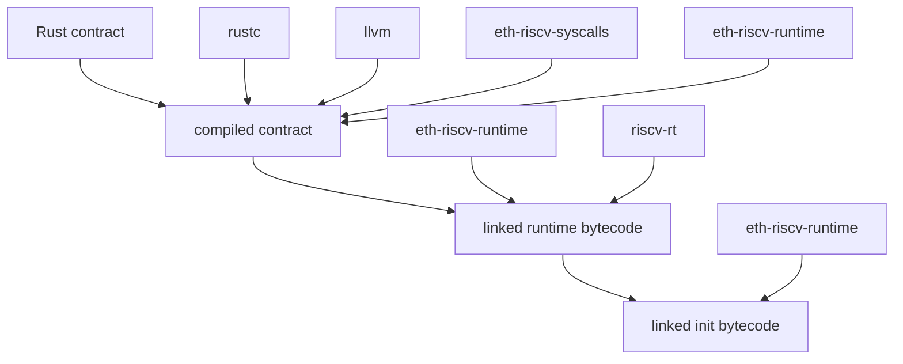
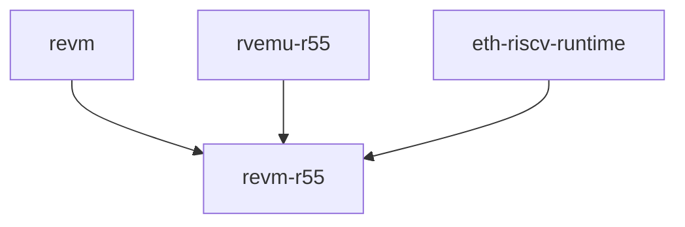

i am trying to understand the r55 project. here u have an intro of what it does:
```
R55 is an experimental Ethereum Execution Environment that seamlessly integrates RISCV smart contracts alongside traditional EVM smart contracts. This dual support operates over the same Ethereum state, and communication happens via ABI-encoded calls.

On the high level, R55 enables the use of pure Rust smart contracts, opening the door for a vast Rust developer community to engage in Ethereum development with minimal barriers to entry, and increasing language and compiler diversity.

On the low level, RISCV code allows for optimization opportunities distinct from the EVM, including the use of off-the-shelf ASICs. This potential for performance gains can be particularly advantageous in specialized domains.
```
and its architecture:
"""
# Architecture

The compiler uses `rustc`, `llvm`,
[eth-riscv-syscalls](https://github.com/r55-eth/r55/tree/main/eth-riscv-syscalls),
[eth-riscv-runtime](https://github.com/r55-eth/r55/tree/main/eth-riscv-runtime)
and [riscv-rt](https://github.com/rust-embedded/riscv/tree/master/riscv-rt) to
compile and link ELF binaries with low-level syscalls to be executed by
[rvemu-r55](https://github.com/r55-eth/rvemu):



The execution environment depends on [revm](https://github.com/bluealloy/revm),
and relies on the [rvemu-r55](https://github.com/r55-eth/rvemu) RISCV
interpreter and
[eth-riscv-runtime](https://github.com/r55-eth/r55/tree/main/eth-riscv-runtime).


"""

i want to impl cross-contract call capabilities, and to do so, i first looked at the `contract-derive` crate, which converts the impl of a struct into a smart contract.
so i implemented a macro similar to the contract one, but to create interfaces from a trait, so that i could follow a similar approach for the cross-contract call capabilities.

here you have the relevant code:
```contract-derive/src/lib.rs
extern crate proc_macro;
use alloy_core::primitives::keccak256;
use alloy_sol_types::SolValue;
use proc_macro::TokenStream;
use quote::{format_ident, quote};
use syn::{parse_macro_input, Data, DeriveInput, Fields, ImplItem, ItemImpl, ItemTrait, TraitItem};
use syn::{FnArg, ReturnType};

#[proc_macro_derive(Event, attributes(indexed))]
pub fn event_derive(input: TokenStream) -> TokenStream {
    let input = parse_macro_input!(input as DeriveInput);
    let name = &input.ident;

    let fields = if let Data::Struct(data) = &input.data {
        if let Fields::Named(fields) = &data.fields {
            &fields.named
        } else {
            panic!("Event must have named fields");
        }
    } else {
        panic!("Event must be a struct");
    };

    // Collect iterators into vectors
    let field_names: Vec<_> = fields.iter().map(|f| &f.ident).collect();
    let field_types: Vec<_> = fields.iter().map(|f| &f.ty).collect();
    let indexed_fields: Vec<_> = fields
        .iter()
        .filter(|f| f.attrs.iter().any(|attr| attr.path.is_ident("indexed")))
        .map(|f| &f.ident)
        .collect();

    let expanded = quote! {
        impl #name {
            const NAME: &'static str = stringify!(#name);
            const INDEXED_FIELDS: &'static [&'static str] = &[
                #(stringify!(#indexed_fields)),*
            ];

            pub fn new(#(#field_names: #field_types),*) -> Self {
                Self {
                    #(#field_names),*
                }
            }
        }

        impl eth_riscv_runtime::log::Event for #name {
            fn encode_log(&self) -> (alloc::vec::Vec<u8>, alloc::vec::Vec<[u8; 32]>) {
                use alloy_sol_types::SolValue;
                use alloy_core::primitives::{keccak256, B256};
                use alloc::vec::Vec;

                let mut signature = Vec::new();
                signature.extend_from_slice(Self::NAME.as_bytes());
                signature.extend_from_slice(b"(");

                let mut first = true;
                let mut topics = alloc::vec![B256::default()];
                let mut data = Vec::new();

                #(
                    if !first { signature.extend_from_slice(b","); }
                    first = false;

                    signature.extend_from_slice(self.#field_names.sol_type_name().as_bytes());
                    let encoded = self.#field_names.abi_encode();

                    let field_name = stringify!(#field_names);
                    if Self::INDEXED_FIELDS.contains(&field_name) && topics.len() < 4 {
                        topics.push(B256::from_slice(&encoded));
                    } else {
                        data.extend_from_slice(&encoded);
                    }
                )*

                signature.extend_from_slice(b")");
                topics[0] = B256::from(keccak256(&signature));

                (data, topics.iter().map(|t| t.0).collect())
            }
        }
    };

    TokenStream::from(expanded)
}

#[proc_macro_attribute]
pub fn show_streams(attr: TokenStream, item: TokenStream) -> TokenStream {
    println!("attr: \"{}\"", attr.to_string());
    println!("item: \"{}\"", item.to_string());
    item
}

#[proc_macro_attribute]
pub fn contract(_attr: TokenStream, item: TokenStream) -> TokenStream {
    let input = parse_macro_input!(item as ItemImpl);
    let struct_name = if let syn::Type::Path(type_path) = &*input.self_ty {
        &type_path.path.segments.first().unwrap().ident
    } else {
        panic!("Expected a struct.");
    };

    let mut public_methods = Vec::new();

    // Iterate over the items in the impl block to find pub methods
    for item in input.items.iter() {
        if let ImplItem::Method(method) = item {
            if let syn::Visibility::Public(_) = method.vis {
                public_methods.push(method.clone());
            }
        }
    }

    let match_arms: Vec<_> = public_methods.iter().enumerate().map(|(_, method)| {
        let method_name = &method.sig.ident;
        let method_selector = u32::from_be_bytes(
            keccak256(
                method_name.to_string()
            )[..4].try_into().unwrap_or_default()
        );
        let arg_types: Vec<_> = method.sig.inputs.iter().skip(1).map(|arg| {
            if let FnArg::Typed(pat_type) = arg {
                let ty = &*pat_type.ty;
                quote! { #ty }
            } else {
                panic!("Expected typed arguments");
            }
        }).collect();

        let arg_names: Vec<_> = (0..method.sig.inputs.len() - 1).map(|i| format_ident!("arg{}", i)).collect();
        let checks = if !is_payable(&method) {
            quote! {
                if eth_riscv_runtime::msg_value() > U256::from(0) {
                    revert();
                }
            }
        } else {
            quote! {}
        };
        // Check if the method has a return type
        let return_handling = match &method.sig.output {
            ReturnType::Default => {
                // No return value
                quote! {
                    self.#method_name(#( #arg_names ),*);
                }
            }
            ReturnType::Type(_, return_type) => {
                // Has return value
                quote! {
                    let result: #return_type = self.#method_name(#( #arg_names ),*);
                    let result_bytes = result.abi_encode();
                    let result_size = result_bytes.len() as u64;
                    let result_ptr = result_bytes.as_ptr() as u64;
                    return_riscv(result_ptr, result_size);
                }
            }
        };

        quote! {
            #method_selector => {
                let (#( #arg_names ),*) = <(#( #arg_types ),*)>::abi_decode(calldata, true).unwrap();
                #checks
                #return_handling
            }
        }
    }).collect();

    let emit_helper = quote! {
        #[macro_export]
        macro_rules! get_type_signature {
            ($arg:expr) => {
                $arg.sol_type_name().as_bytes()
            };
        }

        #[macro_export]
        macro_rules! emit {
            ($event:ident, $($field:expr),*) => {{
                use alloy_sol_types::SolValue;
                use alloy_core::primitives::{keccak256, B256, U256, I256};
                use alloc::vec::Vec;

                let mut signature = alloc::vec![];
                signature.extend_from_slice($event::NAME.as_bytes());
                signature.extend_from_slice(b"(");

                let mut first = true;
                let mut topics = alloc::vec![B256::default()];
                let mut data = Vec::new();

                $(
                    if !first { signature.extend_from_slice(b","); }
                    first = false;

                    signature.extend_from_slice(get_type_signature!($field));
                    let encoded = $field.abi_encode();

                    let field_ident = stringify!($field);
                    if $event::INDEXED_FIELDS.contains(&field_ident) && topics.len() < 4 {
                        topics.push(B256::from_slice(&encoded));
                    } else {
                        data.extend_from_slice(&encoded);
                    }
                )*

                signature.extend_from_slice(b")");
                topics[0] = B256::from(keccak256(&signature));

                if !data.is_empty() {
                    eth_riscv_runtime::emit_log(&data, &topics);
                } else if topics.len() > 1 {
                    let data = topics.pop().unwrap();
                    eth_riscv_runtime::emit_log(data.as_ref(), &topics);
                }
            }};
        }
    };

    // Generate the call method implementation
    let call_method = quote! {
        use alloy_sol_types::SolValue;
        use eth_riscv_runtime::*;

        #emit_helper
        impl Contract for #struct_name {
            fn call(&self) {
                self.call_with_data(&msg_data());
            }

            fn call_with_data(&self, calldata: &[u8]) {
                let selector = u32::from_be_bytes([calldata[0], calldata[1], calldata[2], calldata[3]]);
                let calldata = &calldata[4..];

                match selector {
                    #( #match_arms )*
                    _ => revert(),
                }

                return_riscv(0, 0);
            }
        }

        #[eth_riscv_runtime::entry]
        fn main() -> !
        {
            let contract = #struct_name::default();
            contract.call();
            eth_riscv_runtime::return_riscv(0, 0)
        }
    };

    let output = quote! {
        #input
        #call_method
    };

    TokenStream::from(output)
}

// Empty macro to mark a method as payable
#[proc_macro_attribute]
pub fn payable(_attr: TokenStream, item: TokenStream) -> TokenStream {
    item
}

// Check if a method is tagged with the payable attribute
fn is_payable(method: &syn::ImplItemMethod) -> bool {
    method.attrs.iter().any(|attr| {
        if let Ok(syn::Meta::Path(path)) = attr.parse_meta() {
            if let Some(segment) = path.segments.first() {
                return segment.ident == "payable";
            }
        }
        false
    })
}

#[proc_macro_attribute]
pub fn interface(_attr: TokenStream, item: TokenStream) -> TokenStream {
    // DEBUG
    println!("\n=== Input Trait ===");
    println!("{}", item.to_string());

    let input = parse_macro_input!(item as ItemTrait);
    let trait_name = &input.ident;

    let method_impls: Vec<_> = input
        .items
        .iter()
        .map(|item| {
            if let TraitItem::Method(method) = item {
                let method_name = &method.sig.ident;
                let selector_bytes = keccak256(method_name.to_string())[..4]
                    .try_into()
                    .unwrap_or_default();
                let method_selector = u32::from_be_bytes(selector_bytes);

                // DEBUG
                println!("\n=== Processing Method ===");
                println!("Method name: {}", method_name);
                println!("Selector bytes: {:02x?}", selector_bytes);
                println!("Selector u32: {}", method_selector);

                // Extract argument types and names, skipping self
                let arg_types: Vec<_> = method
                    .sig
                    .inputs
                    .iter()
                    .skip(1)
                    .map(|arg| {
                        if let FnArg::Typed(pat_type) = arg {
                            let ty = &*pat_type.ty;
                            quote! { #ty }
                        } else {
                            panic!("Expected typed arguments");
                        }
                    })
                    .collect();
                let arg_names: Vec<_> = (0..method.sig.inputs.len() - 1)
                    .map(|i| format_ident!("arg{}", i))
                    .collect();

                // Get the return type
                let return_type = match &method.sig.output {
                    ReturnType::Default => quote! { () },
                    ReturnType::Type(_, ty) =>
                        quote! { #ty },
                };

                // Get the return size
                let return_size = match &method.sig.output {
                    ReturnType::Default => quote! { 0_u64 },
                    // TODO: Figure out how to use SolType to figure out the return size
                    ReturnType::Type(_, ty) => quote! {32_u64}

                };

                // Generate calldata with different encoding depending on # of args
                let args_encoding = if arg_names.is_empty() {
                    quote! {
                        let mut complete_calldata = Vec::with_capacity(4);
                        complete_calldata.extend_from_slice(&[
                            #method_selector.to_be_bytes()[0],
                            #method_selector.to_be_bytes()[1],
                            #method_selector.to_be_bytes()[2],
                            #method_selector.to_be_bytes()[3],
                        ]);
                    }
                } else if arg_names.len() == 1 {
                    quote! {
                        let mut args_calldata = #(#arg_names),*.abi_encode();
                        let mut complete_calldata = Vec::with_capacity(4 + args_calldata.len());
                        complete_calldata.extend_from_slice(&[
                            #method_selector.to_be_bytes()[0],
                            #method_selector.to_be_bytes()[1],
                            #method_selector.to_be_bytes()[2],
                            #method_selector.to_be_bytes()[3],
                        ]);
                        complete_calldata.append(&mut args_calldata);
                    }
                } else {
                    quote! {
                        let mut args_calldata = (#(#arg_names),*).abi_encode();
                        let mut complete_calldata = Vec::with_capacity(4 + args_calldata.len());
                        complete_calldata.extend_from_slice(&[
                            #method_selector.to_be_bytes()[0],
                            #method_selector.to_be_bytes()[1],
                            #method_selector.to_be_bytes()[2],
                            #method_selector.to_be_bytes()[3],
                        ]);
                        complete_calldata.append(&mut args_calldata);
                    }
                };

                Some(quote! {
                    pub fn #method_name(&self, #(#arg_names: #arg_types),*) -> Option<#return_type> {
                        use alloy_sol_types::SolValue;
                        use alloc::vec::Vec;

                        #args_encoding

                        // Make the call
                        let result = eth_riscv_runtime::call_contract(
                            self.address,
                            0_u64,
                            &complete_calldata,
                            #return_size as u64
                        )?;

                        // Decode result
                        <#return_type>::abi_decode(&result, true).ok()
                    }
                })
            } else {
                panic!("Expected methods arguments");
            }
        })
        .collect();

    let expanded = quote! {
        pub struct #trait_name {
            address: Address,
        }

        impl #trait_name {
            pub fn new(address: Address) -> Self {
                Self { address }
            }

            #(#method_impls)*
        }
    };

    // DEBUG
    println!("\n=== Generated Code ===");
    println!("{:#}", expanded.to_string().replace(';', ";\n"));

    TokenStream::from(expanded)
}
```

thanks to those macros we can define a contract like:
```erc20/src/lib.rs
#![no_std]
#![no_main]

use core::default::Default;

use contract_derive::{contract, interface, payable, Event};
use eth_riscv_runtime::types::Mapping;

use alloy_core::primitives::{address, Address, U256};

extern crate alloc;
use alloc::{string::String, vec::Vec};

#[derive(Default)]
pub struct ERC20 {
    balances: Mapping<Address, u64>,
    allowances: Mapping<Address, Mapping<Address, u64>>,
    total_supply: U256,
    name: String,
    symbol: String,
    decimals: u8,
}
#[derive(Event)]
pub struct DebugCalldata {
    #[indexed]
    pub target: Address,
    pub calldata: Vec<u8>,
}

#[interface]
trait IERC20 {
    fn balance_of(&self, owner: Address) -> u64;
}

#[derive(Event)]
pub struct Transfer {
    #[indexed]
    pub from: Address,
    #[indexed]
    pub to: Address,
    pub value: u64,
}

#[derive(Event)]
pub struct Mint {
    #[indexed]
    pub from: Address,
    #[indexed]
    pub to: Address,
    pub value: u64,
}

#[contract]
impl ERC20 {
    pub fn x_balance_of(&self, owner: Address, target: Address) -> u64 {
        let token = IERC20::new(target);
        match token.balance_of(owner) {
            Some(balance) => balance,
            _ => eth_riscv_runtime::revert(),
        }
    }

    pub fn balance_of(&self, owner: Address) -> u64 {
        self.balances.read(owner)
    }

    pub fn transfer(&self, to: Address, value: u64) -> bool {
        let from = msg_sender();
        let from_balance = self.balances.read(from);
        let to_balance = self.balances.read(to);

        if from == to || from_balance < value {
            revert();
        }

        self.balances.write(from, from_balance - value);
        self.balances.write(to, to_balance + value);

        log::emit(Transfer::new(from, to, value));
        true
    }

    pub fn approve(&self, spender: Address, value: u64) -> bool {
        let spender_allowances = self.allowances.read(msg_sender());
        spender_allowances.write(spender, value);
        true
    }

    pub fn transfer_from(&self, sender: Address, recipient: Address, amount: u64) -> bool {
        let allowance = self.allowances.read(sender).read(msg_sender());
        let sender_balance = self.balances.read(sender);
        let recipient_balance = self.balances.read(recipient);

        self.allowances
            .read(sender)
            .write(msg_sender(), allowance - amount);
        self.balances.write(sender, sender_balance - amount);
        self.balances.write(recipient, recipient_balance + amount);

        true
    }

    pub fn total_supply(&self) -> U256 {
        self.total_supply
    }

    pub fn allowance(&self, owner: Address, spender: Address) -> u64 {
        self.allowances.read(owner).read(spender)
    }

    #[payable]
    pub fn mint(&self, to: Address, value: u64) -> bool {
        let owner = msg_sender();

        let to_balance = self.balances.read(to);
        self.balances.write(to, to_balance + value);
        log::emit(Transfer::new(
            address!("0000000000000000000000000000000000000000"),
            to,
            value,
        ));
        true
    }
}
```

I am quite happy with how this came out. However, this is just the API that developers will use to interact with other contracts. I still needed to implement the cross contract call capabilities.
To do so, r55 uses a hybrid execution environment leveraging risc-v when possible and via syscalls that use revm.

Here u have the syscalls:
```eth-riscv-syscall/src/lib.rs
#![no_std]

extern crate alloc;

mod error;
pub use error::Error;

macro_rules! syscalls {
    ($(($num:expr, $identifier:ident, $name:expr)),* $(,)?) => {
        #[derive(Copy, Clone, Ord, PartialOrd, Eq, PartialEq, Hash)]
        #[repr(u8)]
        pub enum Syscall {
            $($identifier = $num),*
        }

        impl core::fmt::Display for Syscall {
            fn fmt(&self, f: &mut core::fmt::Formatter) -> core::fmt::Result {
                write!(f, "{}", match self {
                    $(Syscall::$identifier => $name),*
                })
            }
        }

        impl core::str::FromStr for Syscall {
            type Err = Error;
            fn from_str(input: &str) -> Result<Self, Self::Err> {
                match input {
                    $($name => Ok(Syscall::$identifier)),*,
                    name => Err(Error::ParseError { input: alloc::string::String::from(name).into() }),
                }
            }
        }

        impl From<Syscall> for u8 {
            fn from(syscall: Syscall) -> Self {
                syscall as Self
            }
        }

        impl core::convert::TryFrom<u8> for Syscall {
            type Error = Error;
            fn try_from(value: u8) -> Result<Self, Self::Error> {
                match value {
                    $($num => Ok(Syscall::$identifier)),*,
                    num => Err(Error::UnknownOpcode(num)),
                }
            }
        }
    }
}

// Generate `Syscall` enum with supported syscalls and their ids.
//
// The opcode for each syscall matches the corresponding EVM opcode,
// as described on https://www.evm.codes.
//
// t0: 0x20, opcode for keccak256, a0: offset, a1: size, returns keccak256 hash
// t0: 0x32, opcode for origin, returns an address
// t0: 0x33, opcode for caller, returns an address
// t0: 0x34, opcode for callvalue, a0: first limb, a1: second limb, a2: third limb, a3: fourth limb, returns 256-bit value
// t0: 0x3A, opcode for gasprice, returns 256-bit value
// t0: 0x54, opcode for sload, a0: storage key, returns 64-bit value in a0
// t0: 0x55, opcode for sstore, a0: storage key, a1: storage value, returns nothing
// t0: 0xf1, opcode for call, args: TODO
// t0: 0xf3, opcode for return, a0: memory address of data, a1: length of data in bytes, doesn't return
// t0: 0xfd, opcode for revert, doesn't return
syscalls!(
    (0x20, Keccak256, "keccak256"),
    (0x32, Origin, "origin"),
    (0x33, Caller, "caller"),
    (0x34, CallValue, "callvalue"),
    (0x3A, GasPrice, "gasprice"),
    (0x42, Timestamp, "timestamp"),
    (0x43, Number, "number"),
    (0x45, GasLimit, "gaslimit"),
    (0x46, ChainId, "chainid"),
    (0x48, BaseFee, "basefee"),
    (0x54, SLoad, "sload"),
    (0x55, SStore, "sstore"),
    (0xf1, Call, "call"),
    (0xf3, Return, "return"),
    (0xfd, Revert, "revert"),
    (0xA0, Log, "log"),
);
```

and the runtime:
```eth-riscv-runtime/src/lib.rs
#![no_std]
#![no_main]
#![feature(alloc_error_handler, maybe_uninit_write_slice, round_char_boundary)]

use alloc::vec::Vec;
use alloy_core::primitives::{Address, Bytes, B256, U256};
use core::arch::asm;
use core::panic::PanicInfo;
use core::slice;
pub use riscv_rt::entry;

mod alloc;
pub mod block;
pub mod tx;
pub mod types;

pub mod log;
pub use log::{emit_log, Event};

pub mod call;
pub use call::call_contract;

const CALLDATA_ADDRESS: usize = 0x8000_0000;

pub trait Contract {
    fn call(&self);
    fn call_with_data(&self, calldata: &[u8]);
}

pub unsafe fn slice_from_raw_parts(address: usize, length: usize) -> &'static [u8] {
    slice::from_raw_parts(address as *const u8, length)
}

#[panic_handler]
unsafe fn panic(_panic: &PanicInfo<'_>) -> ! {
    static mut IS_PANICKING: bool = false;

    if !IS_PANICKING {
        IS_PANICKING = true;

        revert();
        // TODO with string
        //print!("{panic}\n");
    } else {
        revert();
        // TODO with string
        //print_str("Panic handler has panicked! Things are very dire indeed...\n");
    }
}

use eth_riscv_syscalls::Syscall;

pub fn return_riscv(addr: u64, offset: u64) -> ! {
    unsafe {
        asm!("ecall", in("a0") addr, in("a1") offset, in("t0") u8::from(Syscall::Return));
    }
    unreachable!()
}

pub fn sload(key: u64) -> U256 {
    let first: u64;
    let second: u64;
    let third: u64;
    let fourth: u64;
    unsafe {
        asm!("ecall", lateout("a0") first, lateout("a1") second, lateout("a2") third, lateout("a3") fourth, in("a0") key, in("t0") u8::from(Syscall::SLoad));
    }
    U256::from_limbs([first, second, third, fourth])
}

pub fn sstore(key: u64, value: U256) {
    let limbs = value.as_limbs();
    unsafe {
        asm!("ecall", in("a0") key, in("a1") limbs[0], in("a2") limbs[1], in("a3") limbs[2], in("a4") limbs[3], in("t0") u8::from(Syscall::SStore));
    }
}

pub fn call(
    addr: Address,
    value: u64,
    data_offset: u64,
    data_size: u64,
    res_offset: u64,
    res_size: u64,
) {
    let addr: U256 = addr.into_word().into();
    let addr = addr.as_limbs();
    unsafe {
        asm!(
            "ecall",
            in("a0") addr[0],
            in("a1") addr[1],
            in("a2") addr[2],
            in("a3") value,
            in("a4") data_offset,
            in("a5") data_size,
            in("a6") res_offset,
            in("a7") res_size,
            in("t0") u8::from(Syscall::Call)
        );
    }
}

pub fn revert() -> ! {
    unsafe {
        asm!("ecall", in("t0") u8::from(Syscall::Revert));
    }
    unreachable!()
}

pub fn keccak256(offset: u64, size: u64) -> B256 {
    let first: u64;
    let second: u64;
    let third: u64;
    let fourth: u64;

    unsafe {
        asm!(
            "ecall",
            in("a0") offset,
            in("a1") size,
            lateout("a0") first,
            lateout("a1") second,
            lateout("a2") third,
            lateout("a3") fourth,
            in("t0") u8::from(Syscall::Keccak256)
        );
    }

    let mut bytes = [0u8; 32];

    bytes[0..8].copy_from_slice(&first.to_be_bytes());
    bytes[8..16].copy_from_slice(&second.to_be_bytes());
    bytes[16..24].copy_from_slice(&third.to_be_bytes());
    bytes[24..32].copy_from_slice(&fourth.to_be_bytes());

    B256::from_slice(&bytes)
}

pub fn msg_sender() -> Address {
    let first: u64;
    let second: u64;
    let third: u64;
    unsafe {
        asm!("ecall", lateout("a0") first, lateout("a1") second, lateout("a2") third, in("t0") u8::from(Syscall::Caller));
    }
    let mut bytes = [0u8; 20];
    bytes[0..8].copy_from_slice(&first.to_be_bytes());
    bytes[8..16].copy_from_slice(&second.to_be_bytes());
    bytes[16..20].copy_from_slice(&third.to_be_bytes()[..4]);
    Address::from_slice(&bytes)
}

pub fn msg_value() -> U256 {
    let first: u64;
    let second: u64;
    let third: u64;
    let fourth: u64;
    unsafe {
        asm!("ecall", lateout("a0") first, lateout("a1") second, lateout("a2") third, lateout("a3") fourth, in("t0") u8::from(Syscall::CallValue));
    }
    U256::from_limbs([first, second, third, fourth])
}

pub fn msg_sig() -> [u8; 4] {
    let sig = unsafe { slice_from_raw_parts(CALLDATA_ADDRESS + 8, 4) };
    sig.try_into().unwrap()
}

pub fn msg_data() -> &'static [u8] {
    let length = unsafe { slice_from_raw_parts(CALLDATA_ADDRESS, 8) };
    let length = u64::from_le_bytes([
        length[0], length[1], length[2], length[3], length[4], length[5], length[6], length[7],
    ]) as usize;
    unsafe { slice_from_raw_parts(CALLDATA_ADDRESS + 8, length) }
}

pub fn log(data_ptr: u64, data_size: u64, topics_ptr: u64, topics_size: u64) {
    unsafe {
        asm!(
            "ecall",
            in("a0") data_ptr,
            in("a1") data_size,
            in("a2") topics_ptr,
            in("a3") topics_size,
            in("t0") u8::from(Syscall::Log)
        );
    }
}

#[allow(non_snake_case)]
#[no_mangle]
fn DefaultHandler() {
    revert();
}

#[allow(non_snake_case)]
#[no_mangle]
fn ExceptionHandler(_trap_frame: &riscv_rt::TrapFrame) -> ! {
    revert();
}

pub fn call_contract(addr: Address, value: u64, data: &[u8], ret_size: u64) -> Option<Bytes> {
    let mut ret_data = Vec::with_capacity(ret_size as usize);

    call(
        addr,
        value,
        data.as_ptr() as u64,
        data.len() as u64,
        ret_data.as_ptr() as u64,
        ret_size,
    );

    Some(Bytes::from(ret_data))
}
```

And finally, where the magic happens is in the r55 crate, where we merge the riscv runtime with revm:
```r55/src/exec.rs
use alloy_core::primitives::Keccak256;
use core::{cell::RefCell, ops::Range};
use eth_riscv_interpreter::setup_from_elf;
use eth_riscv_syscalls::Syscall;
use revm::{
    handler::register::EvmHandler,
    interpreter::{
        CallInputs, CallScheme, CallValue, Host, InstructionResult, Interpreter, InterpreterAction,
        InterpreterResult, SharedMemory,
    },
    primitives::{address, Address, Bytes, ExecutionResult, Log, Output, TransactTo, B256, U256},
    Database, Evm, Frame, FrameOrResult, InMemoryDB,
};
use rvemu::{emulator::Emulator, exception::Exception};
use std::{collections::BTreeMap, rc::Rc, sync::Arc};

use super::error::{Error, Result, TxResult};

pub fn deploy_contract(db: &mut InMemoryDB, bytecode: Bytes) -> Result<Address> {
    let mut evm = Evm::builder()
        .with_db(db)
        .modify_tx_env(|tx| {
            tx.caller = address!("000000000000000000000000000000000000000A");
            tx.transact_to = TransactTo::Create;
            tx.data = bytecode;
            tx.value = U256::from(0);
        })
        .append_handler_register(handle_register)
        .build();
    evm.cfg_mut().limit_contract_code_size = Some(usize::MAX);

    let result = evm.transact_commit()?;

    match result {
        ExecutionResult::Success {
            output: Output::Create(_value, Some(addr)),
            ..
        } => {
            println!("Deployed at addr: {:?}", addr);
            Ok(addr)
        }
        result => Err(Error::UnexpectedExecResult(result)),
    }
}

pub fn run_tx(db: &mut InMemoryDB, addr: &Address, calldata: Vec<u8>) -> Result<TxResult> {
    let mut evm = Evm::builder()
        .with_db(db)
        .modify_tx_env(|tx| {
            tx.caller = address!("000000000000000000000000000000000000000A");
            tx.transact_to = TransactTo::Call(*addr);
            tx.data = calldata.into();
            tx.value = U256::from(0);
            tx.gas_price = U256::from(42);
            tx.gas_limit = 100_000;
        })
        .append_handler_register(handle_register)
        .build();

    let result = evm.transact_commit()?;

    match result {
        ExecutionResult::Success {
            reason: _,
            gas_used,
            gas_refunded: _,
            logs,
            output: Output::Call(value),
            ..
        } => {
            println!("Tx result: {:?}", value);
            Ok(TxResult {
                output: value.into(),
                logs,
                gas_used,
                status: true,
            })
        }
        result => Err(Error::UnexpectedExecResult(result)),
    }
}

#[derive(Debug)]
struct RVEmu {
    emu: Emulator,
    returned_data_destiny: Option<Range<u64>>,
    evm_gas: u64,
}

fn riscv_context(frame: &Frame) -> Option<RVEmu> {
    let interpreter = frame.interpreter();

    println!("Creating RISC-V context:");
    println!("Contract address: {}", interpreter.contract.target_address);
    println!("Input size: {}", interpreter.contract.input.len());

    let Some((0xFF, bytecode)) = interpreter.bytecode.split_first() else {
        return None;
    };
    println!("RISC-V bytecode size: {}", bytecode.len());

    match setup_from_elf(bytecode, &interpreter.contract.input) {
        Ok(emu) => {
            println!(
                "RISC-V emulator setup successfully with entry point: 0x{:x}",
                emu.cpu.pc
            );
            Some(RVEmu {
                emu,
                returned_data_destiny: None,
                evm_gas: 0,
            })
        }
        Err(err) => {
            println!("Failed to setup from ELF: {err}");
            None
        }
    }
}

pub fn handle_register<EXT, DB: Database>(handler: &mut EvmHandler<'_, EXT, DB>) {
    let call_stack = Rc::<RefCell<Vec<_>>>::new(RefCell::new(Vec::new()));

    // create a riscv context on call frame.
    let call_stack_inner = call_stack.clone();
    let old_handle = handler.execution.call.clone();
    handler.execution.call = Arc::new(move |ctx, inputs| {
        let result = old_handle(ctx, inputs);
        if let Ok(FrameOrResult::Frame(frame)) = &result {
            println!("----");
            println!("Frame created successfully");
            println!("Contract: {}", frame.interpreter().contract.target_address);
            println!("Code size: {}", frame.interpreter().bytecode.len());

            let context = riscv_context(frame);
            println!("RISC-V context created: {}", context.is_some());
            println!("----");

            call_stack_inner.borrow_mut().push(context);
        }
        result
    });

    // create a riscv context on create frame.
    let call_stack_inner = call_stack.clone();
    let old_handle = handler.execution.create.clone();
    handler.execution.create = Arc::new(move |ctx, inputs| {
        let result = old_handle(ctx, inputs);
        if let Ok(FrameOrResult::Frame(frame)) = &result {
            call_stack_inner.borrow_mut().push(riscv_context(frame));
        }
        result
    });

    // execute riscv context or old logic.
    let old_handle = handler.execution.execute_frame.clone();
    handler.execution.execute_frame = Arc::new(move |frame, memory, instraction_table, ctx| {
        let depth = call_stack.borrow().len() - 1;
        let result = if let Some(Some(riscv_context)) = call_stack.borrow_mut().last_mut() {
            println!(
                "\n*[{}] RISC-V Emu Handler (with PC: 0x{:x})",
                depth, riscv_context.emu.cpu.pc
            );

            execute_riscv(riscv_context, frame.interpreter_mut(), memory, ctx)?
        } else {
            println!("\n*[OLD Handler]");
            old_handle(frame, memory, instraction_table, ctx)?
        };

        // if it is return pop the stack.
        if result.is_return() {
            println!("=== RETURN Frame ===");
            call_stack.borrow_mut().pop();
            println!(
                "Popped frame from stack. Remaining frames: {}",
                call_stack.borrow().len()
            );

            // if cross-contract call, copy return data into memory range expected by the parent
            if !call_stack.borrow().is_empty() {
                if let Some(Some(parent)) = call_stack.borrow_mut().last_mut() {
                    if let Some(return_range) = &parent.returned_data_destiny {
                        if let InterpreterAction::Return { result: res } = &result {
                            // Get allocated memory slice
                            let return_memory = parent
                                .emu
                                .cpu
                                .bus
                                .get_dram_slice(return_range.clone())
                                .expect("unable to get memory from return range");

                            println!("Return data: {:?}", res.output);
                            println!("Memory range: {:?}", return_range);
                            println!("Memory size: {}", return_memory.len());

                            // Write return data to parent's memory
                            if res.output.len() == return_memory.len() {
                                println!("Copying output to memory");
                                return_memory.copy_from_slice(&res.output);
                            }

                            // Update gas spent
                            parent.evm_gas += res.gas.spent();
                        }
                    }
                }
            }
        }

        Ok(result)
    });
}

fn execute_riscv(
    rvemu: &mut RVEmu,
    interpreter: &mut Interpreter,
    shared_memory: &mut SharedMemory,
    host: &mut dyn Host,
) -> Result<InterpreterAction> {
    println!(
        "{} RISC-V execution:\n  PC: {:#x}\n  Contract: {}\n  Return data dst: {:#?}",
        if rvemu.emu.cpu.pc == 0x80300000 {
            "Starting"
        } else {
            "Resuming"
        },
        rvemu.emu.cpu.pc,
        interpreter.contract.target_address,
        &rvemu.returned_data_destiny
    );

    println!("interpreter remaining gas: {}", interpreter.gas.remaining());

    let emu = &mut rvemu.emu;
    emu.cpu.is_count = true;

    let returned_data_destiny = &mut rvemu.returned_data_destiny;
    if let Some(destiny) = std::mem::take(returned_data_destiny) {
        let data = emu.cpu.bus.get_dram_slice(destiny)?;
        if shared_memory.len() >= data.len() {
            data.copy_from_slice(shared_memory.slice(0, data.len()));
        }
        println!("Loaded return data: {}", Bytes::copy_from_slice(data));
    }

    let return_revert = |interpreter: &mut Interpreter, gas_used: u64| {
        let _ = interpreter.gas.record_cost(gas_used);
        Ok(InterpreterAction::Return {
            result: InterpreterResult {
                result: InstructionResult::Revert,
                // return empty bytecode
                output: Bytes::new(),
                gas: interpreter.gas,
            },
        })
    };

    // Run emulator and capture ecalls
    loop {
        let run_result = emu.start();
        match run_result {
            Err(Exception::EnvironmentCallFromMMode) => {
                let t0: u64 = emu.cpu.xregs.read(5);

                let Ok(syscall) = Syscall::try_from(t0 as u8) else {
                    println!("Unhandled syscall: {:?}", t0);
                    return return_revert(interpreter, rvemu.evm_gas);
                };
                println!("> [Syscall::{} - {:#04x}]", syscall, t0);

                match syscall {
                    Syscall::Return => {
                        let ret_offset: u64 = emu.cpu.xregs.read(10);
                        let ret_size: u64 = emu.cpu.xregs.read(11);

                        let r55_gas = r55_gas_used(&emu.cpu.inst_counter);
                        let data_bytes = dram_slice(emu, ret_offset, ret_size)?;

                        let total_cost = r55_gas + rvemu.evm_gas;
                        println!(
                            "evm gas: {}, r55 gas: {}, total cost: {}",
                            rvemu.evm_gas, r55_gas, total_cost
                        );
                        let in_limit = interpreter.gas.record_cost(total_cost);
                        if !in_limit {
                            eprintln!("OUT OF GAS");
                            return Ok(InterpreterAction::Return {
                                result: InterpreterResult {
                                    result: InstructionResult::OutOfGas,
                                    output: Bytes::new(),
                                    gas: interpreter.gas,
                                },
                            });
                        }

                        println!("interpreter remaining gas: {}", interpreter.gas.remaining());
                        return Ok(InterpreterAction::Return {
                            result: InterpreterResult {
                                result: InstructionResult::Return,
                                output: data_bytes.to_vec().into(),
                                gas: interpreter.gas, // FIXME: gas is not correct
                            },
                        });
                    }
                    Syscall::SLoad => {
                        let key: u64 = emu.cpu.xregs.read(10);
                        println!(
                            "SLOAD ({}) - Key: {}",
                            interpreter.contract.target_address, key
                        );
                        match host.sload(interpreter.contract.target_address, U256::from(key)) {
                            Some((value, is_cold)) => {
                                println!(
                                    "SLOAD ({}) - Value: {}",
                                    interpreter.contract.target_address, value
                                );
                                let limbs = value.as_limbs();
                                emu.cpu.xregs.write(10, limbs[0]);
                                emu.cpu.xregs.write(11, limbs[1]);
                                emu.cpu.xregs.write(12, limbs[2]);
                                emu.cpu.xregs.write(13, limbs[3]);
                                if is_cold {
                                    rvemu.evm_gas += 2100
                                } else {
                                    rvemu.evm_gas += 100
                                }
                            }
                            _ => {
                                return return_revert(interpreter, rvemu.evm_gas);
                            }
                        }
                    }
                    Syscall::SStore => {
                        let key: u64 = emu.cpu.xregs.read(10);
                        let first: u64 = emu.cpu.xregs.read(11);
                        let second: u64 = emu.cpu.xregs.read(12);
                        let third: u64 = emu.cpu.xregs.read(13);
                        let fourth: u64 = emu.cpu.xregs.read(14);
                        let result = host.sstore(
                            interpreter.contract.target_address,
                            U256::from(key),
                            U256::from_limbs([first, second, third, fourth]),
                        );
                        if let Some(result) = result {
                            if result.is_cold {
                                rvemu.evm_gas += 2200
                            } else {
                                rvemu.evm_gas += 100
                            }
                        }
                    }
                    Syscall::Call => {
                        let a0: u64 = emu.cpu.xregs.read(10);
                        let a1: u64 = emu.cpu.xregs.read(11);
                        let a2: u64 = emu.cpu.xregs.read(12);
                        let addr = Address::from_word(U256::from_limbs([a0, a1, a2, 0]).into());
                        let value: u64 = emu.cpu.xregs.read(13);

                        // Get calldata
                        let args_offset: u64 = emu.cpu.xregs.read(14);
                        let args_size: u64 = emu.cpu.xregs.read(15);
                        let calldata: Bytes = emu
                            .cpu
                            .bus
                            .get_dram_slice(args_offset..(args_offset + args_size))
                            .unwrap_or(&mut [])
                            .to_vec()
                            .into();

                        // Store where return data should go
                        let ret_offset = emu.cpu.xregs.read(16);
                        let ret_size = emu.cpu.xregs.read(17);
                        println!(
                            "Return data will be written to: {}..{}",
                            ret_offset,
                            ret_offset + ret_size
                        );

                        // Initialize memory region for return data
                        let return_memory = emu
                            .cpu
                            .bus
                            .get_dram_slice(ret_offset..(ret_offset + ret_size))?;
                        return_memory.fill(0);
                        rvemu.returned_data_destiny = Some(ret_offset..(ret_offset + ret_size));

                        // Calculate gas for the call
                        // TODO: Check correctness (tried using evm.codes as refjs)
                        let (empty_account_cost, addr_access_cost) = match host.load_account(addr) {
                            Some(account) => {
                                if account.is_cold {
                                    (0, 2600)
                                } else {
                                    (0, 100)
                                }
                            }
                            None => (25000, 2600),
                        };
                        let value_cost = if value != 0 { 9000 } else { 0 };
                        let call_gas_cost = empty_account_cost + addr_access_cost + value_cost;
                        rvemu.evm_gas += call_gas_cost;

                        let r55_gas = r55_gas_used(&emu.cpu.inst_counter);
                        let total_cost = r55_gas + rvemu.evm_gas;
                        println!("Gas spent before call: {}", total_cost - call_gas_cost);
                        println!("Call gas cost {}", call_gas_cost);
                        // Pass remaining gas to the call
                        let tx = &host.env().tx;
                        let remaining_gas = tx.gas_limit.saturating_sub(total_cost);
                        println!("Remaining gas for call: {}", remaining_gas);
                        if !interpreter.gas.record_cost(total_cost) {
                            eprintln!("OUT OF GAS");
                        };
                        println!("interpreter remaining gas: {}", interpreter.gas.remaining());

                        println!("Call context:");
                        println!("  Caller: {}", interpreter.contract.target_address);
                        println!("  Target Address: {}", addr);
                        println!("  Value: {}", value);
                        println!("  Call Gas limit: {}", remaining_gas);
                        println!("  Tx Gas limit: {}", tx.gas_limit);
                        println!("  Calldata: {:?}", calldata);
                        return Ok(InterpreterAction::Call {
                            inputs: Box::new(CallInputs {
                                input: calldata,
                                gas_limit: remaining_gas,
                                target_address: addr,
                                bytecode_address: addr,
                                caller: interpreter.contract.target_address,
                                value: CallValue::Transfer(U256::from(value)),
                                scheme: CallScheme::Call,
                                is_static: false,
                                is_eof: false,
                                return_memory_offset: 0..0, // We don't need this anymore
                            }),
                        });
                    }
                    Syscall::Revert => {
                        return Ok(InterpreterAction::Return {
                            result: InterpreterResult {
                                result: InstructionResult::Revert,
                                output: Bytes::from(0u32.to_le_bytes()), //TODO: return revert(0,0)
                                gas: interpreter.gas, // FIXME: gas is not correct
                            },
                        });
                    }
                    Syscall::Caller => {
                        let caller = interpreter.contract.caller;
                        // Break address into 3 u64s and write to registers
                        let caller_bytes = caller.as_slice();
                        let first_u64 = u64::from_be_bytes(caller_bytes[0..8].try_into()?);
                        emu.cpu.xregs.write(10, first_u64);
                        let second_u64 = u64::from_be_bytes(caller_bytes[8..16].try_into()?);
                        emu.cpu.xregs.write(11, second_u64);
                        let mut padded_bytes = [0u8; 8];
                        padded_bytes[..4].copy_from_slice(&caller_bytes[16..20]);
                        let third_u64 = u64::from_be_bytes(padded_bytes);
                        emu.cpu.xregs.write(12, third_u64);
                    }
                    Syscall::Keccak256 => {
                        let ret_offset: u64 = emu.cpu.xregs.read(10);
                        let ret_size: u64 = emu.cpu.xregs.read(11);
                        let data_bytes = dram_slice(emu, ret_offset, ret_size)?;

                        let mut hasher = Keccak256::new();
                        hasher.update(data_bytes);
                        let hash: [u8; 32] = hasher.finalize().into();

                        // Write the hash to the emulator's registers
                        emu.cpu
                            .xregs
                            .write(10, u64::from_le_bytes(hash[0..8].try_into()?));
                        emu.cpu
                            .xregs
                            .write(11, u64::from_le_bytes(hash[8..16].try_into()?));
                        emu.cpu
                            .xregs
                            .write(12, u64::from_le_bytes(hash[16..24].try_into()?));
                        emu.cpu
                            .xregs
                            .write(13, u64::from_le_bytes(hash[24..32].try_into()?));
                    }
                    Syscall::CallValue => {
                        let value = interpreter.contract.call_value;
                        let limbs = value.into_limbs();
                        emu.cpu.xregs.write(10, limbs[0]);
                        emu.cpu.xregs.write(11, limbs[1]);
                        emu.cpu.xregs.write(12, limbs[2]);
                        emu.cpu.xregs.write(13, limbs[3]);
                    }
                    Syscall::BaseFee => {
                        let value = host.env().block.basefee;
                        let limbs = value.as_limbs();
                        emu.cpu.xregs.write(10, limbs[0]);
                        emu.cpu.xregs.write(11, limbs[1]);
                        emu.cpu.xregs.write(12, limbs[2]);
                        emu.cpu.xregs.write(13, limbs[3]);
                    }
                    Syscall::ChainId => {
                        let value = host.env().cfg.chain_id;
                        emu.cpu.xregs.write(10, value);
                    }
                    Syscall::GasLimit => {
                        let limit = host.env().block.gas_limit;
                        let limbs = limit.as_limbs();
                        emu.cpu.xregs.write(10, limbs[0]);
                        emu.cpu.xregs.write(11, limbs[1]);
                        emu.cpu.xregs.write(12, limbs[2]);
                        emu.cpu.xregs.write(13, limbs[3]);
                    }
                    Syscall::Number => {
                        let number = host.env().block.number;
                        let limbs = number.as_limbs();
                        emu.cpu.xregs.write(10, limbs[0]);
                        emu.cpu.xregs.write(11, limbs[1]);
                        emu.cpu.xregs.write(12, limbs[2]);
                        emu.cpu.xregs.write(13, limbs[3]);
                    }
                    Syscall::Timestamp => {
                        let timestamp = host.env().block.timestamp;
                        let limbs = timestamp.as_limbs();
                        emu.cpu.xregs.write(10, limbs[0]);
                        emu.cpu.xregs.write(11, limbs[1]);
                        emu.cpu.xregs.write(12, limbs[2]);
                        emu.cpu.xregs.write(13, limbs[3]);
                    }
                    Syscall::GasPrice => {
                        let value = host.env().tx.gas_price;
                        let limbs = value.as_limbs();
                        emu.cpu.xregs.write(10, limbs[0]);
                        emu.cpu.xregs.write(11, limbs[1]);
                        emu.cpu.xregs.write(12, limbs[2]);
                        emu.cpu.xregs.write(13, limbs[3]);
                    }
                    Syscall::Origin => {
                        // Syscall::Origin
                        let origin = host.env().tx.caller;
                        // Break address into 3 u64s and write to registers
                        let origin_bytes = origin.as_slice();

                        let first_u64 = u64::from_be_bytes(origin_bytes[0..8].try_into().unwrap());
                        emu.cpu.xregs.write(10, first_u64);

                        let second_u64 =
                            u64::from_be_bytes(origin_bytes[8..16].try_into().unwrap());
                        emu.cpu.xregs.write(11, second_u64);

                        let mut padded_bytes = [0u8; 8];
                        padded_bytes[..4].copy_from_slice(&origin_bytes[16..20]);
                        let third_u64 = u64::from_be_bytes(padded_bytes);
                        emu.cpu.xregs.write(12, third_u64);
                    }
                    Syscall::Log => {
                        let data_ptr: u64 = emu.cpu.xregs.read(10);
                        let data_size: u64 = emu.cpu.xregs.read(11);
                        let topics_ptr: u64 = emu.cpu.xregs.read(12);
                        let topics_size: u64 = emu.cpu.xregs.read(13);

                        // Read data
                        let data_slice = emu
                            .cpu
                            .bus
                            .get_dram_slice(data_ptr..(data_ptr + data_size))
                            .unwrap_or(&mut []);
                        let data = data_slice.to_vec();

                        // Read topics
                        let topics_start = topics_ptr;
                        let topics_end = topics_ptr + topics_size * 32;
                        let topics_slice = emu
                            .cpu
                            .bus
                            .get_dram_slice(topics_start..topics_end)
                            .unwrap_or(&mut []);
                        let topics = topics_slice
                            .chunks(32)
                            .map(B256::from_slice)
                            .collect::<Vec<B256>>();

                        host.log(Log::new_unchecked(
                            interpreter.contract.target_address,
                            topics,
                            data.into(),
                        ));
                    }
                }
            }
            Ok(_) => {
                println!("Successful instruction at PC: {:#x}", emu.cpu.pc);
                continue;
            }
            Err(e) => {
                println!("Execution error: {:#?}", e);
                let total_cost = r55_gas_used(&emu.cpu.inst_counter) + rvemu.evm_gas;
                return return_revert(interpreter, total_cost);
            }
        }
    }
}

/// Returns RISC-V DRAM slice in a given size range, starts with a given offset
fn dram_slice(emu: &mut Emulator, ret_offset: u64, ret_size: u64) -> Result<&mut [u8]> {
    if ret_size != 0 {
        Ok(emu
            .cpu
            .bus
            .get_dram_slice(ret_offset..(ret_offset + ret_size))?)
    } else {
        Ok(&mut [])
    }
}

fn r55_gas_used(inst_count: &BTreeMap<String, u64>) -> u64 {
    let total_cost = inst_count
        .iter()
        .map(|(inst_name, count)|
            // Gas cost = number of instructions * cycles per instruction
            match inst_name.as_str() {
                // Gas map to approximate cost of each instruction
                // References:
                // http://ithare.com/infographics-operation-costs-in-cpu-clock-cycles/
                // https://www.evm.codes/?fork=cancun#54
                // Division and remainder
                s if s.starts_with("div") || s.starts_with("rem") => count * 25,
                // Multiplications
                s if s.starts_with("mul") => count * 5,
                // Loads
                "lb" | "lh" | "lw" | "ld" | "lbu" | "lhu" | "lwu" => count * 3, // Cost analagous to `MLOAD`
                // Stores
                "sb" | "sh" | "sw" | "sd" | "sc.w" | "sc.d" => count * 3, // Cost analagous to `MSTORE`
                // Branching
                "beq" | "bne" | "blt" | "bge" | "bltu" | "bgeu" | "jal" | "jalr" => count * 3,
                _ => *count, // All other instructions including `add` and `sub`
        })
        .sum::<u64>();

    // This is the minimum 'gas used' to ABI decode 'empty' calldata into Rust type arguments. Real calldata will take more gas.
    // Internalising this would focus gas metering more on the function logic
    let abi_decode_cost = 9_175_538;

    total_cost - abi_decode_cost
}
```

as you can see, it is important to understand how revm works first, so here you have some context:
"""md

# Evm Builder

The builder creates or modifies the EVM and applies different handlers.
It allows setting external context and registering handler custom logic.

The revm `Evm` consists of `Context` and `Handler`.
`Context` is additionally split between `EvmContext` (contains generic `Database`) and `External` context (generic without restrain).
Read [evm](./evm.md) for more information on the internals.

The `Builder` ties dependencies between generic `Database`, `External` context and `Spec`.
It allows handle registers to be added that implement logic on those generics.
As they are interconnected, setting `Database` or `ExternalContext` resets handle registers, so builder stages are introduced to mitigate those misuses.

Simple example of using `EvmBuilder`:

```rust,ignore
  use crate::evm::Evm;

  // build Evm with default values.
  let mut evm = Evm::builder().build();
  let output = evm.transact();
```

## Builder Stages

There are two builder stages that are used to mitigate potential misuse of the builder:
  * `SetGenericStage`: Initial stage that allows setting the database and external context.
  * `HandlerStage`: Allows setting the handler registers but is explicit about setting new generic type as it will void the handler registers.

Functions from one stage are just renamed functions from other stage, it is made so that user is more aware of what underlying function does.
For example, in `SettingDbStage` we have `with_db` function while in `HandlerStage` we have `reset_handler_with_db`, both of them set the database but the latter also resets the handler.
There are multiple functions that are common to both stages such as `build`.

### Builder naming conventions
In both stages we have:
  * `build` creates the Evm.
  * `spec_id` creates new mainnet handler and reapplies all the handler registers.
  * `modify_*` functions are used to modify the database, external context or Env.
  * `clear_*` functions allows setting default values for Environment.
  * `append_handler_register_*` functions are used to push handler registers.
    This will transition the builder to the `HandlerStage`.

In `SetGenericStage` we have:
  * `with_*` are found in `SetGenericStage` and are used to set the generics.

In `HandlerStage` we have:
  * `reset_handler_with_*` is used if we want to change some of the generic types this will reset the handler registers.
    This will transition the builder to the `SetGenericStage`.

# Creating and modification of Evm

Evm implements functions that allow using the `EvmBuilder` without even knowing that it exists.
The most obvious one is `Evm::builder()` that creates a new builder with default values.

Additionally, a function that is very important is `evm.modify()` that allows modifying the Evm.
It returns a builder, allowing users to modify the Evm.

# Examples
The following example uses the builder to create an `Evm` with inspector:
```rust,ignore
  use crate::{
      db::EmptyDB, Context, EvmContext, inspector::inspector_handle_register, inspectors::NoOpInspector, Evm,
  };

  // Create the evm.
  let evm = Evm::builder()
      .with_db(EmptyDB::default())
      .with_external_context(NoOpInspector)
      // Register will modify Handler and call NoOpInspector.
      .append_handler_register(inspector_handle_register)
      // .with_db(..) does not compile as we already locked the builder generics,
      // alternative fn is reset_handler_with_db(..)
      .build();

  // Execute the evm.
  let output = evm.transact();

  // Extract evm context.
  let Context {
      external,
      evm: EvmContext { db, .. },
  } = evm.into_context();
```

The next example changes the spec id and environment of an already built evm.
```rust,ignore
  use crate::{Evm,SpecId::BERLIN};

  // Create default evm.
  let evm = Evm::builder().build();

  // Modify evm spec.
  let evm = evm.modify().with_spec_id(BERLIN).build();

  // Shortcut for above.
  let mut evm = evm.modify_spec_id(BERLIN);

  // Execute the evm.
  let output1 = evm.transact();

  // Example of modifying the tx env.
  let mut evm = evm.modify().modify_tx_env(|env| env.gas_price = 0.into()).build();

  // Execute the evm with modified tx env.
  let output2 = evm.transact();
```

Example of adding custom precompiles to Evm.

```rust,ignore
use super::SpecId;
use crate::{
    db::EmptyDB,
    inspector::inspector_handle_register,
    inspectors::NoOpInspector,
    primitives::{Address, Bytes, ContextStatefulPrecompile, ContextPrecompile, PrecompileResult},
    Context, Evm, EvmContext,
};
use std::sync::Arc;

struct CustomPrecompile;

impl ContextStatefulPrecompile<EvmContext<EmptyDB>, ()> for CustomPrecompile {
    fn call(
        &self,
        _input: &Bytes,
        _gas_limit: u64,
        _context: &mut EvmContext<EmptyDB>,
        _extcontext: &mut (),
    ) -> PrecompileResult {
        Ok((10, Bytes::new()))
    }
}
fn main() {
    let mut evm = Evm::builder()
        .with_empty_db()
        .with_spec_id(SpecId::HOMESTEAD)
        .append_handler_register(|handler| {
            let precompiles = handler.pre_execution.load_precompiles();
            handler.pre_execution.load_precompiles = Arc::new(move || {
                let mut precompiles = precompiles.clone();
                precompiles.extend([(
                    Address::ZERO,
                    ContextPrecompile::ContextStateful(Arc::new(CustomPrecompile)),
                )]);
                precompiles
            });
        })
        .build();

    evm.transact().unwrap();
}

```

## Appending handler registers

Handler registers are simple functions that allow modifying the `Handler` logic by replacing the handler functions.
They are used to add custom logic to the evm execution but as they are free to modify the `Handler` in any form they want.
There may be conflicts if handlers that override the same function are added.

The most common use case for adding new logic to `Handler` is `Inspector` that is used to inspect the execution of the evm.
Example of this can be found in [`Inspector`](./inspector.md) documentation.
"""

as you can see, `r55/src/exec.rs` impls `handle_register()` to use the risc-v instruction set.
it is also worth mentioning that (inside the `handle_register() fn`) i added this code to try to handle x-contract calls:
```
            // if cross-contract call, copy return data into memory range expected by the parent
            if !call_stack.borrow().is_empty() {
                if let Some(Some(parent)) = call_stack.borrow_mut().last_mut() {
                    if let Some(return_range) = &parent.returned_data_destiny {
                        if let InterpreterAction::Return { result: res } = &result {
                            // Get allocated memory slice
                            let return_memory = parent
                                .emu
                                .cpu
                                .bus
                                .get_dram_slice(return_range.clone())
                                .expect("unable to get memory from return range");

                            println!("Return data: {:?}", res.output);
                            println!("Memory range: {:?}", return_range);
                            println!("Memory size: {}", return_memory.len());

                            // Write return data to parent's memory
                            if res.output.len() == return_memory.len() {
                                println!("Copying output to memory");
                                return_memory.copy_from_slice(&res.output);
                            }

                            // Update gas spent
                            parent.evm_gas += res.gas.spent();
                        }
                    }
                }
            }
```

with all of that, you should have a good understanding of the project and what i'm trying to achieve.
so to finish, let me share the test suit that i'm using:

```r55/tests/e2e.rs
use alloy_primitives::Bytes;
use alloy_sol_types::SolValue;
use r55::{
    compile_deploy, compile_with_prefix,
    exec::{deploy_contract, run_tx},
    test_utils::{add_balance_to_db, get_selector_from_sig, initialize_logger},
};
use revm::{
    primitives::{address, Address},
    InMemoryDB,
};

const ERC20_PATH: &str = concat!(env!("CARGO_MANIFEST_DIR"), "/../erc20");

#[test]
fn erc20() {
    initialize_logger();

    let mut db = InMemoryDB::default();

    let bytecode = compile_with_prefix(compile_deploy, ERC20_PATH).unwrap();
    let addr1 = deploy_contract(&mut db, bytecode.clone()).unwrap();
    let addr2 = deploy_contract(&mut db, bytecode).unwrap();

    let selector_balance = get_selector_from_sig("balance_of");
    let selector_x_balance = get_selector_from_sig("x_balance_of");
    let selector_mint = get_selector_from_sig("mint");
    let alice: Address = address!("000000000000000000000000000000000000000A");
    let value_mint: u64 = 42;
    let mut calldata_balance = alice.abi_encode();
    let mut calldata_mint = (alice, value_mint).abi_encode();
    let mut calldata_x_balance = (alice, addr1).abi_encode();

    add_balance_to_db(&mut db, alice, 1e18 as u64);

    let mut complete_calldata_balance = selector_balance.to_vec();
    complete_calldata_balance.append(&mut calldata_balance);

    let mut complete_calldata_mint = selector_mint.to_vec();
    complete_calldata_mint.append(&mut calldata_mint);

    let mut complete_calldata_x_balance = selector_x_balance.to_vec();
    complete_calldata_x_balance.append(&mut calldata_x_balance);

    println!("\n----------------------------------------------------------");
    println!("-- MINT TX -----------------------------------------------");
    println!("----------------------------------------------------------");
    println!(
        " > TX Calldata: {:#?\n}",
        Bytes::from(complete_calldata_mint.clone())
    );
    run_tx(&mut db, &addr1, complete_calldata_mint.clone()).unwrap();
    println!("\n----------------------------------------------------------");
    println!("-- BALANCE OF TX -----------------------------------------");
    println!("----------------------------------------------------------");
    println!(
        " > TX Calldata: {:#?}\n",
        Bytes::from(complete_calldata_balance.clone())
    );
    run_tx(&mut db, &addr1, complete_calldata_balance.clone()).unwrap();
    println!("\n----------------------------------------------------------");
    println!("-- X-CONTRACT BALANCE OF TX ------------------------------");
    println!("----------------------------------------------------------");
    println!(
        " > TX Calldata: {:#?}\n",
        Bytes::from(complete_calldata_x_balance.clone())
    );
    match run_tx(&mut db, &addr2, complete_calldata_x_balance.clone()) {
        Ok(res) => log::info!("res: {:#?}", res),
        Err(e) => log::error!("{:#?}", e),
    };
}
```

and the logs that they output:
```
---- erc20 stdout ----
Creating RISC-V context:
Contract address: 0xf6a171f57ACAc30C292e223eA8aDBb28abD3E14d
Input size: 0
RISC-V bytecode size: 96233
RISC-V emulator setup successfully with entry point: 0x80300000

*[0] RISC-V Emu Handler (with PC: 0x80300000)
Starting RISC-V execution:
  PC: 0x80300000
  Contract: 0xf6a171f57ACAc30C292e223eA8aDBb28abD3E14d
  Return data dst: None
> [Syscall::return - 0xf3]
> total R55 gas: 131383
> About to log gas costs:
  - Operation cost: 131383
  - Gas remaining: 18446744073708358085
  - Gas limit: 18446744073708358085
  - Gas spent: 0
> Gas recorded successfully:
  - Gas remaining: 18446744073708358085
  - Gas spent: 131383
interpreter remaining gas: 18446744073708226702
=== RETURN Frame ===
Popped frame from stack. Remaining frames: 0
Deployed at addr: 0xf6a171f57acac30c292e223ea8adbb28abd3e14d
Creating RISC-V context:
Contract address: 0x114c28ea2CDe99e41D2566B1CfAA64a84f564caf
Input size: 0
RISC-V bytecode size: 96233
RISC-V emulator setup successfully with entry point: 0x80300000

*[0] RISC-V Emu Handler (with PC: 0x80300000)
Starting RISC-V execution:
  PC: 0x80300000
  Contract: 0x114c28ea2CDe99e41D2566B1CfAA64a84f564caf
  Return data dst: None
> [Syscall::return - 0xf3]
> total R55 gas: 131383
> About to log gas costs:
  - Operation cost: 131383
  - Gas remaining: 18446744073708358085
  - Gas limit: 18446744073708358085
  - Gas spent: 0
> Gas recorded successfully:
  - Gas remaining: 18446744073708358085
  - Gas spent: 131383
interpreter remaining gas: 18446744073708226702
=== RETURN Frame ===
Popped frame from stack. Remaining frames: 0
Deployed at addr: 0x114c28ea2cde99e41d2566b1cfaa64a84f564caf

----------------------------------------------------------
-- MINT TX -----------------------------------------------
----------------------------------------------------------
 > TX Calldata: 0xdaf0b3c5000000000000000000000000000000000000000000000000000000000000000a000000000000000000000000000000000000000000000000000000000000002a
----
Frame created successfully
Contract: 0xf6a171f57ACAc30C292e223eA8aDBb28abD3E14d
Code size: 80970
Creating RISC-V context:
Contract address: 0xf6a171f57ACAc30C292e223eA8aDBb28abD3E14d
Input size: 68
RISC-V bytecode size: 80969
RISC-V emulator setup successfully with entry point: 0x80300000
RISC-V context created: true
----

*[0] RISC-V Emu Handler (with PC: 0x80300000)
Starting RISC-V execution:
  PC: 0x80300000
  Contract: 0xf6a171f57ACAc30C292e223eA8aDBb28abD3E14d
  Return data dst: None
> [Syscall::caller - 0x33]
> [Syscall::keccak256 - 0x20]
> [Syscall::sload - 0x54]
SLOAD (0xf6a171f57ACAc30C292e223eA8aDBb28abD3E14d) - Key: 2674963704631452285
SLOAD (0xf6a171f57ACAc30C292e223eA8aDBb28abD3E14d) - Value: 0
> About to log gas costs:
  - Operation cost: 2100
  - Gas remaining: 78656
  - Gas limit: 78656
  - Gas spent: 0
> Gas recorded successfully:
  - Gas remaining: 78656
  - Gas spent: 2100
> [Syscall::keccak256 - 0x20]
> [Syscall::sstore - 0x55]
> About to log gas costs:
  - Operation cost: 100
  - Gas remaining: 76556
  - Gas limit: 78656
  - Gas spent: 2100
> Gas recorded successfully:
  - Gas remaining: 76556
  - Gas spent: 2200
> [Syscall::log - 0xa0]
> [Syscall::return - 0xf3]
> total R55 gas: 24041
> About to log gas costs:
  - Operation cost: 24041
  - Gas remaining: 76456
  - Gas limit: 78656
  - Gas spent: 2200
> Gas recorded successfully:
  - Gas remaining: 76456
  - Gas spent: 26241
interpreter remaining gas: 52415
=== RETURN Frame ===
Popped frame from stack. Remaining frames: 0
Tx result: 0x0000000000000000000000000000000000000000000000000000000000000001

----------------------------------------------------------
-- BALANCE OF TX -----------------------------------------
----------------------------------------------------------
 > TX Calldata: 0xd35a73cd000000000000000000000000000000000000000000000000000000000000000a

----
Frame created successfully
Contract: 0xf6a171f57ACAc30C292e223eA8aDBb28abD3E14d
Code size: 80970
Creating RISC-V context:
Contract address: 0xf6a171f57ACAc30C292e223eA8aDBb28abD3E14d
Input size: 36
RISC-V bytecode size: 80969
RISC-V emulator setup successfully with entry point: 0x80300000
RISC-V context created: true
----

*[0] RISC-V Emu Handler (with PC: 0x80300000)
Starting RISC-V execution:
  PC: 0x80300000
  Contract: 0xf6a171f57ACAc30C292e223eA8aDBb28abD3E14d
  Return data dst: None
> [Syscall::callvalue - 0x34]
> [Syscall::keccak256 - 0x20]
> [Syscall::sload - 0x54]
SLOAD (0xf6a171f57ACAc30C292e223eA8aDBb28abD3E14d) - Key: 2674963704631452285
SLOAD (0xf6a171f57ACAc30C292e223eA8aDBb28abD3E14d) - Value: 42
> About to log gas costs:
  - Operation cost: 2100
  - Gas remaining: 78796
  - Gas limit: 78796
  - Gas spent: 0
> Gas recorded successfully:
  - Gas remaining: 78796
  - Gas spent: 2100
> [Syscall::return - 0xf3]
> total R55 gas: 4018
> About to log gas costs:
  - Operation cost: 4018
  - Gas remaining: 76696
  - Gas limit: 78796
  - Gas spent: 2100
> Gas recorded successfully:
  - Gas remaining: 76696
  - Gas spent: 6118
interpreter remaining gas: 72678
=== RETURN Frame ===
Popped frame from stack. Remaining frames: 0
Tx result: 0x000000000000000000000000000000000000000000000000000000000000002a

----------------------------------------------------------
-- X-CONTRACT BALANCE OF TX ------------------------------
----------------------------------------------------------
 > TX Calldata: 0x51f59fb7000000000000000000000000000000000000000000000000000000000000000a000000000000000000000000f6a171f57acac30c292e223ea8adbb28abd3e14d

----
Frame created successfully
Contract: 0x114c28ea2CDe99e41D2566B1CfAA64a84f564caf
Code size: 80970
Creating RISC-V context:
Contract address: 0x114c28ea2CDe99e41D2566B1CfAA64a84f564caf
Input size: 68
RISC-V bytecode size: 80969
RISC-V emulator setup successfully with entry point: 0x80300000
RISC-V context created: true
----

*[0] RISC-V Emu Handler (with PC: 0x80300000)
Starting RISC-V execution:
  PC: 0x80300000
  Contract: 0x114c28ea2CDe99e41D2566B1CfAA64a84f564caf
  Return data dst: None
> [Syscall::callvalue - 0x34]
> [Syscall::call - 0xf1]
Return data will be written to: 2150663548..2150663580
> About to log gas costs:
  - Operation cost: 2600
  - Gas remaining: 78428
  - Gas limit: 78428
  - Gas spent: 0
> Gas recorded successfully:
  - Gas remaining: 78428
  - Gas spent: 2600
Call context:
  Caller: 0x114c28ea2CDe99e41D2566B1CfAA64a84f564caf
  Target Address: 0xf6a171f57ACAc30C292e223eA8aDBb28abD3E14d
  Value: 0
  Calldata: 0xd35a73cd000000000000000000000000000000000000000000000000000000000000000a
----
Frame created successfully
Contract: 0xf6a171f57ACAc30C292e223eA8aDBb28abD3E14d
Code size: 80970
Creating RISC-V context:
Contract address: 0xf6a171f57ACAc30C292e223eA8aDBb28abD3E14d
Input size: 36
RISC-V bytecode size: 80969
RISC-V emulator setup successfully with entry point: 0x80300000
RISC-V context created: true
----

*[1] RISC-V Emu Handler (with PC: 0x80300000)
Starting RISC-V execution:
  PC: 0x80300000
  Contract: 0xf6a171f57ACAc30C292e223eA8aDBb28abD3E14d
  Return data dst: None
> [Syscall::callvalue - 0x34]
> [Syscall::keccak256 - 0x20]
> [Syscall::sload - 0x54]
SLOAD (0xf6a171f57ACAc30C292e223eA8aDBb28abD3E14d) - Key: 2674963704631452285
SLOAD (0xf6a171f57ACAc30C292e223eA8aDBb28abD3E14d) - Value: 42
> About to log gas costs:
  - Operation cost: 2100
  - Gas remaining: 75828
  - Gas limit: 75828
  - Gas spent: 0
> Gas recorded successfully:
  - Gas remaining: 75828
  - Gas spent: 2100
> [Syscall::return - 0xf3]
> total R55 gas: 4018
> About to log gas costs:
  - Operation cost: 4018
  - Gas remaining: 73728
  - Gas limit: 75828
  - Gas spent: 2100
> Gas recorded successfully:
  - Gas remaining: 73728
  - Gas spent: 6118
interpreter remaining gas: 69710
=== RETURN Frame ===
Popped frame from stack. Remaining frames: 1
Return data: 0x000000000000000000000000000000000000000000000000000000000000002a
Memory range: 2150663548..2150663580
Memory size: 32
Copying output to memory

*[0] RISC-V Emu Handler (with PC: 0x80300c5e)
Resuming RISC-V execution:
  PC: 0x80300c5e
  Contract: 0x114c28ea2CDe99e41D2566B1CfAA64a84f564caf
  Return data dst: Some(
    2150663548..2150663580,
)
Loaded return data: 0x000000000000000000000000000000000000000000000000000000000000002a
> [Syscall::return - 0xf3]
> total R55 gas: 7553
> About to log gas costs:
  - Operation cost: 7553
  - Gas remaining: 145538
  - Gas limit: 78428
thread 'erc20' panicked at /Users/rusowsky/.cargo/registry/src/index.crates.io-6f17d22bba15001f/revm-interpreter-5.0.0/src/gas.rs:66:9:
attempt to subtract with overflow
note: run with `RUST_BACKTRACE=1` environment variable to display a backtrace
```

as u can see the cross-contract calls are almost ready! i am just facing some final issues with the gas calculations. To be more precise, the issue that i have is that the interpreter is refunding the whole unspent amount of each frame, making the "remaining" greater than the limit, which then creates an underflow.
i will share some of the relevant revm files to see if you can help me figure out how to fix the issue:

> interpreter gas definition: in this case we want to look at `erase_cost()` fn
```revm/crates/interpreter/src/gas.rs
//! EVM gas calculation utilities.

mod calc;
mod constants;

pub use calc::*;
pub use constants::*;

/// Represents the state of gas during execution.
#[derive(Clone, Copy, Debug, Default, PartialEq, Eq, Hash)]
#[cfg_attr(feature = "serde", derive(serde::Serialize, serde::Deserialize))]
pub struct Gas {
    /// The initial gas limit. This is constant throughout execution.
    limit: u64,
    /// The remaining gas.
    remaining: u64,
    /// Refunded gas. This is used only at the end of execution.
    refunded: i64,
    /// Memoisation of values for memory expansion cost.
    memory: MemoryGas,
}

impl Gas {
    /// Creates a new `Gas` struct with the given gas limit.
    #[inline]
    pub const fn new(limit: u64) -> Self {
        Self {
            limit,
            remaining: limit,
            refunded: 0,
            memory: MemoryGas::new(),
        }
    }

    /// Creates a new `Gas` struct with the given gas limit, but without any gas remaining.
    #[inline]
    pub const fn new_spent(limit: u64) -> Self {
        Self {
            limit,
            remaining: 0,
            refunded: 0,
            memory: MemoryGas::new(),
        }
    }

    /// Returns the gas limit.
    #[inline]
    pub const fn limit(&self) -> u64 {
        self.limit
    }

    /// Returns the **last** memory expansion cost.
    #[inline]
    #[deprecated = "memory expansion cost is not tracked anymore; \
                    calculate it using `SharedMemory::current_expansion_cost` instead"]
    #[doc(hidden)]
    pub const fn memory(&self) -> u64 {
        0
    }

    /// Returns the total amount of gas that was refunded.
    #[inline]
    pub const fn refunded(&self) -> i64 {
        self.refunded
    }

    /// Returns the total amount of gas spent.
    #[inline]
    pub const fn spent(&self) -> u64 {
        self.limit - self.remaining
    }

    /// Returns the amount of gas remaining.
    #[inline]
    pub const fn remaining(&self) -> u64 {
        self.remaining
    }

    /// Return remaining gas after subtracting 63/64 parts.
    pub const fn remaining_63_of_64_parts(&self) -> u64 {
        self.remaining - self.remaining / 64
    }

    /// Erases a gas cost from the totals.
    #[inline]
    pub fn erase_cost(&mut self, returned: u64) {
        self.remaining += returned;
    }

    /// Spends all remaining gas.
    #[inline]
    pub fn spend_all(&mut self) {
        self.remaining = 0;
    }

    /// Records a refund value.
    ///
    /// `refund` can be negative but `self.refunded` should always be positive
    /// at the end of transact.
    #[inline]
    pub fn record_refund(&mut self, refund: i64) {
        self.refunded += refund;
    }

    /// Set a refund value for final refund.
    ///
    /// Max refund value is limited to Nth part (depending of fork) of gas spend.
    ///
    /// Related to EIP-3529: Reduction in refunds
    #[inline]
    pub fn set_final_refund(&mut self, is_london: bool) {
        let max_refund_quotient = if is_london { 5 } else { 2 };
        self.refunded = (self.refunded() as u64).min(self.spent() / max_refund_quotient) as i64;
    }

    /// Set a refund value. This overrides the current refund value.
    #[inline]
    pub fn set_refund(&mut self, refund: i64) {
        self.refunded = refund;
    }

    /// Records an explicit cost.
    ///
    /// Returns `false` if the gas limit is exceeded.
    #[inline]
    #[must_use = "prefer using `gas!` instead to return an out-of-gas error on failure"]
    pub fn record_cost(&mut self, cost: u64) -> bool {
        let (remaining, overflow) = self.remaining.overflowing_sub(cost);
        let success = !overflow;
        if success {
            self.remaining = remaining;
        }
        success
    }

    /// Record memory expansion
    #[inline]
    #[must_use = "internally uses record_cost that flags out of gas error"]
    pub fn record_memory_expansion(&mut self, new_len: usize) -> MemoryExtensionResult {
        let Some(additional_cost) = self.memory.record_new_len(new_len) else {
            return MemoryExtensionResult::Same;
        };

        if !self.record_cost(additional_cost) {
            return MemoryExtensionResult::OutOfGas;
        }

        MemoryExtensionResult::Extended
    }
}

pub enum MemoryExtensionResult {
    /// Memory was extended.
    Extended,
    /// Memory size stayed the same.
    Same,
    /// Not enough gas to extend memory.s
    OutOfGas,
}

/// Utility struct that speeds up calculation of memory expansion
/// It contains the current memory length and its memory expansion cost.
///
/// It allows us to split gas accounting from memory structure.
#[derive(Clone, Copy, Default, Debug, PartialEq, Eq, Hash)]
#[cfg_attr(feature = "serde", derive(serde::Serialize, serde::Deserialize))]
pub struct MemoryGas {
    /// Current memory length
    pub words_num: usize,
    /// Current memory expansion cost
    pub expansion_cost: u64,
}

impl MemoryGas {
    pub const fn new() -> Self {
        Self {
            words_num: 0,
            expansion_cost: 0,
        }
    }

    #[inline]
    pub fn record_new_len(&mut self, new_num: usize) -> Option<u64> {
        if new_num <= self.words_num {
            return None;
        }
        self.words_num = new_num;
        let mut cost = crate::gas::calc::memory_gas(new_num);
        core::mem::swap(&mut self.expansion_cost, &mut cost);
        // safe to subtract because we know that new_len > length
        // notice the swap above.
        Some(self.expansion_cost - cost)
    }
}
```

> handler frame, in this case we want to look at `return_result()` fn:
```revm/crates/handler/src/frame.rs
use super::frame_data::*;
use bytecode::{Eof, EOF_MAGIC_BYTES};
use context_interface::{
    journaled_state::{JournalCheckpoint, JournaledState},
    BlockGetter, Cfg, CfgGetter, ErrorGetter, JournalStateGetter, JournalStateGetterDBError,
    Transaction, TransactionGetter,
};
use core::{cell::RefCell, cmp::min};
use handler_interface::{Frame, FrameOrResultGen, PrecompileProvider};
use interpreter::{
    gas,
    interpreter::{EthInterpreter, InstructionProvider},
    interpreter_types::{LoopControl, ReturnData, RuntimeFlag},
    return_ok, return_revert, CallInputs, CallOutcome, CallValue, CreateInputs, CreateOutcome,
    CreateScheme, EOFCreateInputs, EOFCreateKind, FrameInput, Gas, Host, InputsImpl,
    InstructionResult, Interpreter, InterpreterAction, InterpreterResult, InterpreterTypes,
    SharedMemory,
};
use precompile::PrecompileErrors;
use primitives::{keccak256, Address, Bytes, B256, U256};
use specification::{
    constants::CALL_STACK_LIMIT,
    hardfork::SpecId::{self, HOMESTEAD, LONDON, OSAKA, SPURIOUS_DRAGON},
};
use state::Bytecode;
use std::borrow::ToOwned;
use std::{rc::Rc, sync::Arc};

pub struct EthFrame<CTX, ERROR, IW: InterpreterTypes, PRECOMPILE, INSTRUCTIONS> {
    _phantom: core::marker::PhantomData<fn() -> (CTX, ERROR)>,
    data: FrameData,
    // TODO include this
    depth: usize,
    /// Journal checkpoint.
    pub checkpoint: JournalCheckpoint,
    /// Interpreter.
    pub interpreter: Interpreter<IW>,
    /// Precompiles provider.
    pub precompiles: PRECOMPILE,
    /// Instruction provider.
    pub instructions: INSTRUCTIONS,
    // This is worth making as a generic type FrameSharedContext.
    pub memory: Rc<RefCell<SharedMemory>>,
}

impl<CTX, IW, ERROR, PRECOMP, INST> EthFrame<CTX, ERROR, IW, PRECOMP, INST>
where
    CTX: JournalStateGetter,
    IW: InterpreterTypes,
{
    pub fn new(
        data: FrameData,
        depth: usize,
        interpreter: Interpreter<IW>,
        checkpoint: JournalCheckpoint,
        precompiles: PRECOMP,
        instructions: INST,
        memory: Rc<RefCell<SharedMemory>>,
    ) -> Self {
        Self {
            _phantom: core::marker::PhantomData,
            data,
            depth,
            interpreter,
            checkpoint,
            precompiles,
            instructions,
            memory,
        }
    }
}

impl<CTX, ERROR, PRECOMPILE, INSTRUCTION>
    EthFrame<CTX, ERROR, EthInterpreter<()>, PRECOMPILE, INSTRUCTION>
where
    CTX: EthFrameContext<ERROR>,
    ERROR: EthFrameError<CTX>,
    PRECOMPILE: PrecompileProvider<Context = CTX, Error = ERROR>,
{
    /// Make call frame
    #[inline]
    pub fn make_call_frame(
        context: &mut CTX,
        depth: usize,
        memory: Rc<RefCell<SharedMemory>>,
        inputs: &CallInputs,
        mut precompile: PRECOMPILE,
        instructions: INSTRUCTION,
    ) -> Result<FrameOrResultGen<Self, FrameResult>, ERROR> {
        let gas = Gas::new(inputs.gas_limit);

        let return_result = |instruction_result: InstructionResult| {
            Ok(FrameOrResultGen::Result(FrameResult::Call(CallOutcome {
                result: InterpreterResult {
                    result: instruction_result,
                    gas,
                    output: Bytes::new(),
                },
                memory_offset: inputs.return_memory_offset.clone(),
            })))
        };

        // Check depth
        if depth > CALL_STACK_LIMIT as usize {
            return return_result(InstructionResult::CallTooDeep);
        }

        // Make account warm and loaded
        let _ = context
            .journal()
            .load_account_delegated(inputs.bytecode_address)?;

        // Create subroutine checkpoint
        let checkpoint = context.journal().checkpoint();

        // Touch address. For "EIP-158 State Clear", this will erase empty accounts.
        if let CallValue::Transfer(value) = inputs.value {
            // Transfer value from caller to called account
            // Target will get touched even if balance transferred is zero.
            if let Some(i) =
                context
                    .journal()
                    .transfer(&inputs.caller, &inputs.target_address, value)?
            {
                context.journal().checkpoint_revert(checkpoint);
                return return_result(i.into());
            }
        }

        if let Some(result) = precompile.run(
            context,
            &inputs.bytecode_address,
            &inputs.input,
            inputs.gas_limit,
        )? {
            if result.result.is_ok() {
                context.journal().checkpoint_commit();
            } else {
                context.journal().checkpoint_revert(checkpoint);
            }
            Ok(FrameOrResultGen::Result(FrameResult::Call(CallOutcome {
                result,
                memory_offset: inputs.return_memory_offset.clone(),
            })))
        } else {
            let account = context
                .journal()
                .load_account_code(inputs.bytecode_address)?;

            // TODO Request from foundry to get bytecode hash.
            let _code_hash = account.info.code_hash();
            let mut bytecode = account.info.code.clone().unwrap_or_default();

            // ExtDelegateCall is not allowed to call non-EOF contracts.
            if inputs.scheme.is_ext_delegate_call()
                && !bytecode.bytes_slice().starts_with(&EOF_MAGIC_BYTES)
            {
                return return_result(InstructionResult::InvalidExtDelegateCallTarget);
            }

            if bytecode.is_empty() {
                context.journal().checkpoint_commit();
                return return_result(InstructionResult::Stop);
            }

            if let Bytecode::Eip7702(eip7702_bytecode) = bytecode {
                bytecode = context
                    .journal()
                    .load_account_code(eip7702_bytecode.delegated_address)?
                    .info
                    .code
                    .clone()
                    .unwrap_or_default();
            }

            // Create interpreter and executes call and push new CallStackFrame.
            let interpreter_input = InputsImpl {
                target_address: inputs.target_address,
                caller_address: inputs.caller,
                input: inputs.input.clone(),
                call_value: inputs.value.get(),
            };

            Ok(FrameOrResultGen::Frame(Self::new(
                FrameData::Call(CallFrame {
                    return_memory_range: inputs.return_memory_offset.clone(),
                }),
                depth,
                Interpreter::new(
                    memory.clone(),
                    bytecode,
                    interpreter_input,
                    inputs.is_static,
                    false,
                    context.cfg().spec().into(),
                    inputs.gas_limit,
                ),
                checkpoint,
                precompile,
                instructions,
                memory,
            )))
        }
    }

    /// Make create frame.
    #[inline]
    pub fn make_create_frame(
        context: &mut CTX,
        depth: usize,
        memory: Rc<RefCell<SharedMemory>>,
        inputs: &CreateInputs,
        precompile: PRECOMPILE,
        instructions: INSTRUCTION,
    ) -> Result<FrameOrResultGen<Self, FrameResult>, ERROR> {
        let spec = context.cfg().spec().into();
        let return_error = |e| {
            Ok(FrameOrResultGen::Result(FrameResult::Create(
                CreateOutcome {
                    result: InterpreterResult {
                        result: e,
                        gas: Gas::new(inputs.gas_limit),
                        output: Bytes::new(),
                    },
                    address: None,
                },
            )))
        };

        // Check depth
        if depth > CALL_STACK_LIMIT as usize {
            return return_error(InstructionResult::CallTooDeep);
        }

        // Prague EOF
        if spec.is_enabled_in(OSAKA) && inputs.init_code.starts_with(&EOF_MAGIC_BYTES) {
            return return_error(InstructionResult::CreateInitCodeStartingEF00);
        }

        // Fetch balance of caller.
        let caller_balance = context
            .journal()
            .load_account(inputs.caller)?
            .map(|a| a.info.balance);

        // Check if caller has enough balance to send to the created contract.
        if caller_balance.data < inputs.value {
            return return_error(InstructionResult::OutOfFunds);
        }

        // Increase nonce of caller and check if it overflows
        let old_nonce;
        if let Some(nonce) = context.journal().inc_account_nonce(inputs.caller)? {
            old_nonce = nonce - 1;
        } else {
            return return_error(InstructionResult::Return);
        }

        // Create address
        // TODO incorporating code hash inside interpreter. It was a request by foundry.
        let mut _init_code_hash = B256::ZERO;
        let created_address = match inputs.scheme {
            CreateScheme::Create => inputs.caller.create(old_nonce),
            CreateScheme::Create2 { salt } => {
                _init_code_hash = keccak256(&inputs.init_code);
                inputs.caller.create2(salt.to_be_bytes(), _init_code_hash)
            }
        };

        // created address is not allowed to be a precompile.
        // TODO add precompile check
        if precompile.contains(&created_address) {
            return return_error(InstructionResult::CreateCollision);
        }

        // warm load account.
        context.journal().load_account(created_address)?;

        // create account, transfer funds and make the journal checkpoint.
        let checkpoint = match context.journal().create_account_checkpoint(
            inputs.caller,
            created_address,
            inputs.value,
            spec,
        ) {
            Ok(checkpoint) => checkpoint,
            Err(e) => return return_error(e.into()),
        };

        let bytecode = Bytecode::new_legacy(inputs.init_code.clone());

        let interpreter_input = InputsImpl {
            target_address: created_address,
            caller_address: inputs.caller,
            input: Bytes::new(),
            call_value: inputs.value,
        };

        Ok(FrameOrResultGen::Frame(Self::new(
            FrameData::Create(CreateFrame { created_address }),
            depth,
            Interpreter::new(
                memory.clone(),
                bytecode,
                interpreter_input,
                false,
                false,
                spec,
                inputs.gas_limit,
            ),
            checkpoint,
            precompile,
            instructions,
            memory,
        )))
    }

    /// Make create frame.
    #[inline]
    pub fn make_eofcreate_frame(
        context: &mut CTX,
        depth: usize,
        memory: Rc<RefCell<SharedMemory>>,
        inputs: &EOFCreateInputs,
        precompile: PRECOMPILE,
        instructions: INSTRUCTION,
    ) -> Result<FrameOrResultGen<Self, FrameResult>, ERROR> {
        let spec = context.cfg().spec().into();
        let return_error = |e| {
            Ok(FrameOrResultGen::Result(FrameResult::EOFCreate(
                CreateOutcome {
                    result: InterpreterResult {
                        result: e,
                        gas: Gas::new(inputs.gas_limit),
                        output: Bytes::new(),
                    },
                    address: None,
                },
            )))
        };

        let (input, initcode, created_address) = match &inputs.kind {
            EOFCreateKind::Opcode {
                initcode,
                input,
                created_address,
            } => (input.clone(), initcode.clone(), Some(*created_address)),
            EOFCreateKind::Tx { initdata } => {
                // decode eof and init code.
                // TODO handle inc_nonce handling more gracefully.
                let Ok((eof, input)) = Eof::decode_dangling(initdata.clone()) else {
                    context.journal().inc_account_nonce(inputs.caller)?;
                    return return_error(InstructionResult::InvalidEOFInitCode);
                };

                if eof.validate().is_err() {
                    // TODO (EOF) new error type.
                    context.journal().inc_account_nonce(inputs.caller)?;
                    return return_error(InstructionResult::InvalidEOFInitCode);
                }

                // Use nonce from tx to calculate address.
                let tx = context.tx().common_fields();
                let create_address = tx.caller().create(tx.nonce());

                (input, eof, Some(create_address))
            }
        };

        // Check depth
        if depth > CALL_STACK_LIMIT as usize {
            return return_error(InstructionResult::CallTooDeep);
        }

        // Fetch balance of caller.
        let caller_balance = context
            .journal()
            .load_account(inputs.caller)?
            .map(|a| a.info.balance);

        // Check if caller has enough balance to send to the created contract.
        if caller_balance.data < inputs.value {
            return return_error(InstructionResult::OutOfFunds);
        }

        // Increase nonce of caller and check if it overflows
        let Some(nonce) = context.journal().inc_account_nonce(inputs.caller)? else {
            // can't happen on mainnet.
            return return_error(InstructionResult::Return);
        };
        let old_nonce = nonce - 1;

        let created_address = created_address.unwrap_or_else(|| inputs.caller.create(old_nonce));

        // created address is not allowed to be a precompile.
        if precompile.contains(&created_address) {
            return return_error(InstructionResult::CreateCollision);
        }

        // Load account so it needs to be marked as warm for access list.
        context.journal().load_account(created_address)?;

        // create account, transfer funds and make the journal checkpoint.
        let checkpoint = match context.journal().create_account_checkpoint(
            inputs.caller,
            created_address,
            inputs.value,
            spec,
        ) {
            Ok(checkpoint) => checkpoint,
            Err(e) => return return_error(e.into()),
        };

        let interpreter_input = InputsImpl {
            target_address: created_address,
            caller_address: inputs.caller,
            input,
            call_value: inputs.value,
        };

        Ok(FrameOrResultGen::Frame(Self::new(
            FrameData::EOFCreate(EOFCreateFrame { created_address }),
            depth,
            Interpreter::new(
                memory.clone(),
                Bytecode::Eof(Arc::new(initcode)),
                interpreter_input,
                false,
                true,
                spec,
                inputs.gas_limit,
            ),
            checkpoint,
            precompile,
            instructions,
            memory,
        )))
    }

    pub fn init_with_context(
        depth: usize,
        frame_init: FrameInput,
        memory: Rc<RefCell<SharedMemory>>,
        precompile: PRECOMPILE,
        instructions: INSTRUCTION,
        context: &mut CTX,
    ) -> Result<FrameOrResultGen<Self, FrameResult>, ERROR> {
        match frame_init {
            FrameInput::Call(inputs) => {
                Self::make_call_frame(context, depth, memory, &inputs, precompile, instructions)
            }
            FrameInput::Create(inputs) => {
                Self::make_create_frame(context, depth, memory, &inputs, precompile, instructions)
            }
            FrameInput::EOFCreate(inputs) => Self::make_eofcreate_frame(
                context,
                depth,
                memory,
                &inputs,
                precompile,
                instructions,
            ),
        }
    }
}

impl<CTX, ERROR, PRECOMPILE, INSTRUCTION> Frame
    for EthFrame<CTX, ERROR, EthInterpreter<()>, PRECOMPILE, INSTRUCTION>
where
    CTX: EthFrameContext<ERROR>,
    ERROR: EthFrameError<CTX>,
    PRECOMPILE: PrecompileProvider<Context = CTX, Error = ERROR>,
    INSTRUCTION: InstructionProvider<WIRE = EthInterpreter<()>, Host = CTX>,
{
    type Context = CTX;
    type Error = ERROR;
    type FrameInit = FrameInput;
    type FrameResult = FrameResult;

    fn init_first(
        context: &mut Self::Context,
        frame_input: Self::FrameInit,
    ) -> Result<FrameOrResultGen<Self, Self::FrameResult>, Self::Error> {
        let memory = Rc::new(RefCell::new(SharedMemory::new()));
        let precompiles = PRECOMPILE::new(context);
        let instructions = INSTRUCTION::new(context);

        // load precompiles addresses as warm.
        for address in precompiles.warm_addresses() {
            context.journal().warm_account(address);
        }

        memory.borrow_mut().new_context();
        Self::init_with_context(0, frame_input, memory, precompiles, instructions, context)
    }

    fn init(
        &self,
        context: &mut CTX,
        frame_init: Self::FrameInit,
    ) -> Result<FrameOrResultGen<Self, Self::FrameResult>, Self::Error> {
        self.memory.borrow_mut().new_context();
        Self::init_with_context(
            self.depth + 1,
            frame_init,
            self.memory.clone(),
            self.precompiles.clone(),
            self.instructions.clone(),
            context,
        )
    }

    fn run(
        &mut self,
        context: &mut Self::Context,
    ) -> Result<FrameOrResultGen<Self::FrameInit, Self::FrameResult>, Self::Error> {
        let spec = context.cfg().spec().into();

        // run interpreter
        let next_action = self.interpreter.run(self.instructions.table(), context);

        let mut interpreter_result = match next_action {
            InterpreterAction::NewFrame(new_frame) => {
                return Ok(FrameOrResultGen::Frame(new_frame))
            }
            InterpreterAction::Return { result } => result,
            InterpreterAction::None => unreachable!("InterpreterAction::None is not expected"),
        };

        // Handle return from frame
        let result = match &self.data {
            FrameData::Call(frame) => {
                // return_call
                // revert changes or not.
                if interpreter_result.result.is_ok() {
                    context.journal().checkpoint_commit();
                } else {
                    context.journal().checkpoint_revert(self.checkpoint);
                }
                FrameOrResultGen::Result(FrameResult::Call(CallOutcome::new(
                    interpreter_result,
                    frame.return_memory_range.clone(),
                )))
            }
            FrameData::Create(frame) => {
                let max_code_size = context.cfg().max_code_size();
                return_create(
                    context.journal(),
                    self.checkpoint,
                    &mut interpreter_result,
                    frame.created_address,
                    max_code_size,
                    spec,
                );

                FrameOrResultGen::Result(FrameResult::Create(CreateOutcome::new(
                    interpreter_result,
                    Some(frame.created_address),
                )))
            }
            FrameData::EOFCreate(frame) => {
                let max_code_size = context.cfg().max_code_size();
                return_eofcreate(
                    context.journal(),
                    self.checkpoint,
                    &mut interpreter_result,
                    frame.created_address,
                    max_code_size,
                );

                FrameOrResultGen::Result(FrameResult::EOFCreate(CreateOutcome::new(
                    interpreter_result,
                    Some(frame.created_address),
                )))
            }
        };

        Ok(result)
    }

    fn return_result(
        &mut self,
        context: &mut Self::Context,
        result: Self::FrameResult,
    ) -> Result<(), Self::Error> {
        self.memory.borrow_mut().free_context();
        context.take_error()?;

        // Insert result to the top frame.
        match result {
            FrameResult::Call(outcome) => {
                let out_gas = outcome.gas();
                let ins_result = *outcome.instruction_result();
                let returned_len = outcome.result.output.len();

                let interpreter = &mut self.interpreter;
                let mem_length = outcome.memory_length();
                let mem_start = outcome.memory_start();
                *interpreter.return_data.buffer_mut() = outcome.result.output;

                let target_len = min(mem_length, returned_len);

                if ins_result == InstructionResult::FatalExternalError {
                    panic!("Fatal external error in insert_call_outcome");
                }

                let item = {
                    if interpreter.runtime_flag.is_eof() {
                        match ins_result {
                            return_ok!() => U256::ZERO,
                            return_revert!() => U256::from(1),
                            _ => U256::from(2),
                        }
                    } else if ins_result.is_ok() {
                        U256::from(1)
                    } else {
                        U256::ZERO
                    }
                };
                // Safe to push without stack limit check
                let _ = interpreter.stack.push(item);

                // return unspend gas.
                if ins_result.is_ok_or_revert() {
                    interpreter.control.gas().erase_cost(out_gas.remaining());
                    self.memory
                        .borrow_mut()
                        .set(mem_start, &interpreter.return_data.buffer()[..target_len]);
                }

                if ins_result.is_ok() {
                    interpreter.control.gas().record_refund(out_gas.refunded());
                }
            }
            FrameResult::Create(outcome) => {
                let instruction_result = *outcome.instruction_result();
                let interpreter = &mut self.interpreter;

                let buffer = interpreter.return_data.buffer_mut();
                if instruction_result == InstructionResult::Revert {
                    // Save data to return data buffer if the create reverted
                    *buffer = outcome.output().to_owned()
                } else {
                    // Otherwise clear it. Note that RETURN opcode should abort.
                    buffer.clear();
                };

                assert_ne!(
                    instruction_result,
                    InstructionResult::FatalExternalError,
                    "Fatal external error in insert_eofcreate_outcome"
                );

                let this_gas = interpreter.control.gas();
                if instruction_result.is_ok_or_revert() {
                    this_gas.erase_cost(outcome.gas().remaining());
                }

                let stack_item = if instruction_result.is_ok() {
                    this_gas.record_refund(outcome.gas().refunded());
                    outcome.address.unwrap_or_default().into_word().into()
                } else {
                    U256::ZERO
                };

                // Safe to push without stack limit check
                let _ = interpreter.stack.push(stack_item);
            }
            FrameResult::EOFCreate(outcome) => {
                let instruction_result = *outcome.instruction_result();
                let interpreter = &mut self.interpreter;
                if instruction_result == InstructionResult::Revert {
                    // Save data to return data buffer if the create reverted
                    *interpreter.return_data.buffer_mut() = outcome.output().to_owned()
                } else {
                    // Otherwise clear it. Note that RETURN opcode should abort.
                    interpreter.return_data.buffer_mut().clear();
                };

                assert_ne!(
                    instruction_result,
                    InstructionResult::FatalExternalError,
                    "Fatal external error in insert_eofcreate_outcome"
                );

                let this_gas = interpreter.control.gas();
                if instruction_result.is_ok_or_revert() {
                    this_gas.erase_cost(outcome.gas().remaining());
                }

                let stack_item = if instruction_result.is_ok() {
                    this_gas.record_refund(outcome.gas().refunded());
                    outcome.address.expect("EOF Address").into_word().into()
                } else {
                    U256::ZERO
                };

                // Safe to push without stack limit check
                let _ = interpreter.stack.push(stack_item);
            }
        }

        Ok(())
    }
}

pub fn return_create<Journal: JournaledState>(
    journal: &mut Journal,
    checkpoint: JournalCheckpoint,
    interpreter_result: &mut InterpreterResult,
    address: Address,
    max_code_size: usize,
    spec_id: SpecId,
) {
    // if return is not ok revert and return.
    if !interpreter_result.result.is_ok() {
        journal.checkpoint_revert(checkpoint);
        return;
    }
    // Host error if present on execution
    // if ok, check contract creation limit and calculate gas deduction on output len.
    //
    // EIP-3541: Reject new contract code starting with the 0xEF byte
    if spec_id.is_enabled_in(LONDON) && interpreter_result.output.first() == Some(&0xEF) {
        journal.checkpoint_revert(checkpoint);
        interpreter_result.result = InstructionResult::CreateContractStartingWithEF;
        return;
    }

    // EIP-170: Contract code size limit
    // By default limit is 0x6000 (~25kb)
    if spec_id.is_enabled_in(SPURIOUS_DRAGON) && interpreter_result.output.len() > max_code_size {
        journal.checkpoint_revert(checkpoint);
        interpreter_result.result = InstructionResult::CreateContractSizeLimit;
        return;
    }
    let gas_for_code = interpreter_result.output.len() as u64 * gas::CODEDEPOSIT;
    if !interpreter_result.gas.record_cost(gas_for_code) {
        // record code deposit gas cost and check if we are out of gas.
        // EIP-2 point 3: If contract creation does not have enough gas to pay for the
        // final gas fee for adding the contract code to the state, the contract
        //  creation fails (i.e. goes out-of-gas) rather than leaving an empty contract.
        if spec_id.is_enabled_in(HOMESTEAD) {
            journal.checkpoint_revert(checkpoint);
            interpreter_result.result = InstructionResult::OutOfGas;
            return;
        } else {
            interpreter_result.output = Bytes::new();
        }
    }
    // if we have enough gas we can commit changes.
    journal.checkpoint_commit();

    // Do analysis of bytecode straight away.
    let bytecode = Bytecode::new_legacy(interpreter_result.output.clone());

    // set code
    journal.set_code(address, bytecode);

    interpreter_result.result = InstructionResult::Return;
}

pub fn return_eofcreate<Journal: JournaledState>(
    journal: &mut Journal,
    checkpoint: JournalCheckpoint,
    interpreter_result: &mut InterpreterResult,
    address: Address,
    max_code_size: usize,
) {
    // Note we still execute RETURN opcode and return the bytes.
    // In EOF those opcodes should abort execution.
    //
    // In RETURN gas is still protecting us from ddos and in oog,
    // behaviour will be same as if it failed on return.
    //
    // Bytes of RETURN will drained in `insert_eofcreate_outcome`.
    if interpreter_result.result != InstructionResult::ReturnContract {
        journal.checkpoint_revert(checkpoint);
        return;
    }

    if interpreter_result.output.len() > max_code_size {
        journal.checkpoint_revert(checkpoint);
        interpreter_result.result = InstructionResult::CreateContractSizeLimit;
        return;
    }

    // deduct gas for code deployment.
    let gas_for_code = interpreter_result.output.len() as u64 * gas::CODEDEPOSIT;
    if !interpreter_result.gas.record_cost(gas_for_code) {
        journal.checkpoint_revert(checkpoint);
        interpreter_result.result = InstructionResult::OutOfGas;
        return;
    }

    journal.checkpoint_commit();

    // decode bytecode has a performance hit, but it has reasonable restrains.
    let bytecode = Eof::decode(interpreter_result.output.clone()).expect("Eof is already verified");

    // eof bytecode is going to be hashed.
    journal.set_code(address, Bytecode::Eof(Arc::new(bytecode)));
}

pub trait EthFrameContext<ERROR>:
    TransactionGetter + Host + ErrorGetter<Error = ERROR> + BlockGetter + JournalStateGetter + CfgGetter
{
}

impl<
        ERROR,
        CTX: TransactionGetter
            + ErrorGetter<Error = ERROR>
            + BlockGetter
            + JournalStateGetter
            + CfgGetter
            + Host,
    > EthFrameContext<ERROR> for CTX
{
}

pub trait EthFrameError<CTX: JournalStateGetter>:
    From<JournalStateGetterDBError<CTX>> + From<PrecompileErrors>
{
}

impl<CTX: JournalStateGetter, T: From<JournalStateGetterDBError<CTX>> + From<PrecompileErrors>>
    EthFrameError<CTX> for T
{
}
```
